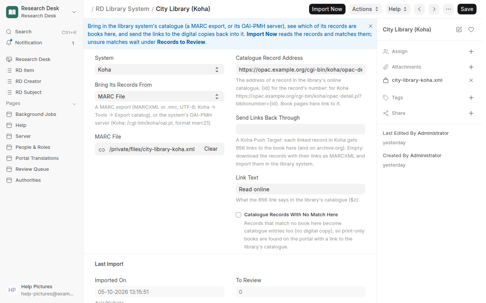

# Koha & interoperability

Research Desk can run **on its own** as a discovery portal and digital library, or
**alongside** an integrated library system (ILS) such as Koha. In the second case, Koha keeps
print holdings, patrons and circulation, while Research Desk provides full text, reading and
citation for digitised books. Records flow between them through standards, not custom code.

## Option A: Koha harvests Research Desk over OAI-PMH

Research Desk is an **OAI-PMH 2.0 data provider**:

```
<BASE_URL>/api/method/sok_resdesk.oai.endpoint
```

| | |
|---|---|
| Metadata formats | `oai_dc` (Dublin Core), `marc21` (MARCXML) |
| Sets | source collections (e.g. `ServantsOfKnowledge`, `KannadaUniversity`, `JaiGyan`), and your curated collections as `rd:<web address>` (e.g. `rd:epigraphy`) |
| Identifiers | `oai:<repository-id>:<IA identifier>` |
| Selective harvesting | `from` / `until` (UTC), `set` |
| Page size | 100 records with resumption tokens |

Try it:

```
…/sok_resdesk.oai.endpoint?verb=Identify
…/sok_resdesk.oai.endpoint?verb=ListSets
…/sok_resdesk.oai.endpoint?verb=ListRecords&metadataPrefix=marc21&set=KannadaUniversity
```

**In Koha versions with the built-in OAI-PMH harvester** ([Koha bug 35659](https://bugs.koha-community.org/bugzilla3/show_bug.cgi?id=35659);
look for *Administration → OAI repositories* in your Koha), add Research Desk as a repository:

1. New repository, with the endpoint above as the URL.
2. Metadata prefix `marc21`; optionally a set.
3. Pick a MARC framework and the item type for e-books, then enable the harvester's
   scheduled job.
4. Koha imports bibliographic records with an **856** link to the Research Desk page and one
   to the Internet Archive, so OPAC users click straight through to read.

Menu names and scheduling differ between Koha versions, so check your version's manual. If
your Koha has no harvester yet, use Option B, or run any external harvester that writes
MARCXML files for Koha's import tools.

Any other harvester works the same way: VuFind, DSpace, BASE, CORE, OCLC WorldCat Digital
Collection Gateway, or your own scripts.

Harvesters don't log in, so by default they get the records a visitor can find: members-only
(*Login to find*) books are left out. For a Koha on your internal network that should list
every book, set Settings → **OAI-PMH Shares** to *All published records*. See
[Who can see what](access.md#koha-oai-pmh-and-exports).

## Option B: import MARCXML files

For a one-off load, or when harvesting isn't set up:

- One book: **MARCXML** on its page.
- A reading list: **My list → MARCXML (Koha)**.
- A whole ingest profile or the whole catalogue (staff only):
  `GET /api/method/sok_resdesk.api.marcxml_all?profile=<profile name>` (logged in).

In Koha: *Cataloguing → Stage MARC records for import* → upload the file, record type
*Bibliographic*, format **MARCXML**, then *Manage staged records → Import*.

### What's in the MARC record

| Tag | Content |
|---|---|
| 001 / 003 | IA identifier / `SOK-ResDesk` |
| 007, 008 | online text resource; date, language (MARC code), place `ii` |
| 020 | ISBN when known |
| 035 | `(IA)<identifier>` |
| 041 | language |
| 100 / 700 | first author / further authors and romanised forms |
| 245 / 246 | title / romanised or alternate title |
| 264 | place, publisher, year |
| 300 | `1 online resource (N pages)` |
| 336 / 337 / 338 | RDA content, media and carrier types |
| 490 | series |
| 520 | description |
| 533 | electronic reproduction note (Servants of Knowledge / Internet Archive) |
| 540 | licence / rights |
| 653 | subjects (uncontrolled) |
| 856 40 / 856 41 | Research Desk page / Internet Archive |

Records validate against the Library of Congress MARC21 slim schema. Subjects are
uncontrolled (653) because IA subject data is free text; mapping to LCSH or other schemes is on
the [roadmap](roadmap.md).

## Option C: Research Desk pushes records into Koha

Instead of Koha harvesting, Research Desk can create and update biblios in Koha directly through
Koha's REST API (Koha 23.11 or later), for one collection or everything, by hand or whenever a
book is edited. It remembers each biblionumber, so later pushes update the same record. Set it up
under **Research Desk → Push Targets**; see
[Pushing metadata to other systems](collections-and-metadata.md#koha).

## Option E: bring the library's catalogue in, link it, send the links back

Most libraries already have their books catalogued in Koha (or Evergreen, SOUL, e-Granthalaya
or another system). Research Desk can read that catalogue, find which of its records are books
it already holds (scanned, on archive.org or in a repository), and give the library system the
links to them, so its OPAC offers *Read online* on every book that has a digital copy.

Desk → Research Desk → **Library Systems** → New:



| Field | Meaning |
|---|---|
| **System** | Koha, Evergreen, SOUL, e-Granthalaya or Other |
| **Bring Its Records From** | a **MARC File** (MARCXML or ISO 2709 `.mrc`, UTF-8; Koha → Tools → Export catalog) or **OAI-PMH** (Koha: `https://<opac>/cgi-bin/koha/oai.pl`, format `marc21`) |
| **Catalogue Record Address** | a record in the library's OPAC, `{id}` for its number: `https://<opac>/cgi-bin/koha/opac-detail.pl?biblionumber={id}`. Book pages here link to it (*In the library's catalogue*) |
| **Send Links Back Through** | a Koha Push Target ([Option C](#option-c-research-desk-pushes-records-into-koha)): its credentials are used to add the links |
| **Link Text** | what the link says in the OPAC (`856 $z`, *Read online*) |
| **Catalogue Records With No Match Here** | records that match no book here become catalogue entries too (no digital copy), so print-only books are found on the portal with a link to the OPAC |

**Import Now** reads the records (each is kept as received) and matches them:

1. a record whose 856 already points to an archive.org book here, or with the same **ISBN**, is
   that book;
2. otherwise the search engine finds candidates by **title** (the record's own-script title from
   880 and its romanised 245 alike) and each is scored on title, **authors** and **year**. A
   confident, unambiguous match is **Linked**; an unsure one waits under **Records to Review**,
   where a cataloguer picks *This is the book* or *Not a Match*. A person's decision is never
   undone by a later import.

**Send Links Back** (Koha): every linked biblio is fetched from Koha as it is now and gets an
`856 4 1` with the link to the book here (and one to archive.org when the book is there), only
if it doesn't have it already; nothing else in the record changes, and each record is sent once.
For any other system, **Download Records With Links** gives the linked records as the system
gave them, with the links added, as MARCXML to import there (match on the record number to
overlay).

## Option D: Research Desk on its own

Everything a reader needs (discovery, faceted search, full text, reading, citation) works
without any other system. The Frappe data model can be extended with holdings, patrons and
loans for a complete library system. See [Architecture](architecture.md#towards-a-full-library-system).

## Other standards

| Need | Use |
|---|---|
| Reference managers | citation meta tags, RIS, BibTeX, CSL-JSON (see [Citations](citations.md)) |
| Search engines | schema.org JSON-LD on each book page |
| Page images and the reader | Internet Archive BookReader and IIIF (`iiif.archive.org`) |
| Your own software | [HTTP API](api.md) |
