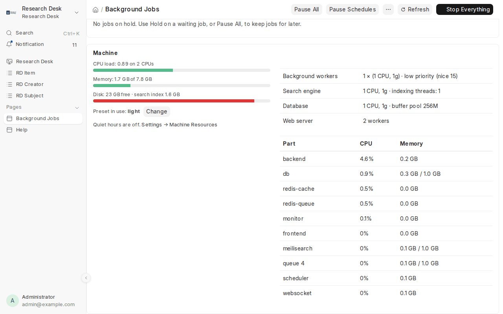

# Operations

All commands below run from the Research Desk folder. `./resdesk.sh help` lists them.

## Start, stop, status

```bash
./resdesk.sh start | stop | restart
./resdesk.sh status          # containers + catalogue counts + search health
./resdesk.sh logs            # backend log; or: logs queue | create-site | meilisearch
```

Docker Desktop's *restart policy* brings Research Desk back after a reboot as long as Docker
itself starts.

## Backups

Research Desk backs up its database **every night** by itself (Settings → *Server & Updates*:
daily, weekly or off, how many to keep, with or without uploaded files). The **Server** page in
the Desk lists the backups, makes one on request and lets a System Manager download them
([Server](server.md#backups)). Those backups stay on the server's disk, so also keep copies
somewhere else. From the command line:

```bash
./resdesk.sh backup
```

This writes a database dump plus uploaded files into `./site-backups/`. Copy that folder somewhere
safe (Nextcloud, Synology, an external disk). The **search index is not backed up**, because
it can always be rebuilt from the catalogue:

```bash
./resdesk.sh reindex --background   # all workers; page text comes from the local cache
./resdesk.sh reindex --no-pages     # books only, fast
./resdesk.sh reindex --reset --background   # drop and rebuild the page index (some upgrades need this)
```

To restore (onto the same or a fresh install):

```bash
./resdesk.sh restore site-backups/<date>-<site>-database.sql.gz
```

It asks for confirmation, restores the database, migrates, and rebuilds the search index.

## Ingest workers

```bash
./resdesk.sh workers 4      # run four ingest workers (saved in .env as QUEUE_WORKERS)
./resdesk.sh progress       # watch the latest ingest run
```

Restarting workers (`./resdesk.sh restart`, `update`, a reboot) stops batches that were in
progress. Within about 15 minutes the run is marked *Interrupted* and carries on by itself,
skipping the books already done ([more](ingesting.md#large-ingests-run-in-parallel)).

## Resources: how much of the machine Research Desk may use

Big ingests and re-indexing can keep every CPU busy for hours. Four things keep that in check:

**1. A preset** caps the background workers, the search engine and the database:

```bash
./resdesk.sh resources            # what is set, and what each part uses right now
./resdesk.sh resources light      # a laptop or a shared computer
./resdesk.sh resources standard   # a desktop or small server (the default)
./resdesk.sh resources server     # a machine for Research Desk alone
```

| | light | standard | server |
|---|---|---|---|
| Background workers (books processed at once) | 1 | 2 | 4 |
| CPU / memory per worker | 1 / 1 GB | 1 / 1.5 GB | 2 / 2 GB |
| Search engine CPU / memory | 1 / 1 GB | 2 / 2 GB | no limit |
| Search-indexing threads / memory | 1 / 256 MB | 2 / 1 GB | automatic |
| Database CPU / memory, buffer pool | 1 / 1 GB, 256 MB | 1 / 1.5 GB, 512 MB | no limit, 2 GB |
| Worker priority (nice) | 19 (lowest) | 19 (lowest) | 19 (lowest) |
| Memory in all, at most | about 3 GB | about 6.5 GB | as needed |

Fine-tune any cap (the preset becomes *custom*):

```bash
./resdesk.sh resources set QUEUE_WORKERS=3 QUEUE_CPUS=1.5 MEILI_MAX_INDEXING_THREADS=2
```

| Setting | Caps |
|---|---|
| `QUEUE_WORKERS` | background workers: how many batches run at once (ingest, re-index, exports, pushes) |
| `WORKERS_PER_CONTAINER` | workers inside each worker container (default 1). For Coolify and other hosts that can't run copies of a container: set `QUEUE_WORKERS=1` and this to the number of workers you want |
| `QUEUE_CPUS`, `QUEUE_MEMORY` | each worker container, e.g. `1.5`, `2g` (`0` = no limit): all its workers share it |
| `WORKER_NICE` | worker priority, 0–19: 19 (the default) is gentlest on everything else; lower gives workers more CPU time when the machine is busy |
| `MEILI_CPUS`, `MEILI_MEMORY` | the search engine |
| `MEILI_MAX_INDEXING_THREADS`, `MEILI_MAX_INDEXING_MEMORY` | how hard the search engine indexes, e.g. `2`, `1Gb` (empty = automatic) |
| `MEILI_MAX_BATCHED_TASKS` | at most this many waiting tasks in one indexing batch (default 50): lower it if the search engine runs out of memory ([stuck indexing](#search-indexing-is-stuck)) |
| `DB_CPUS`, `DB_MEMORY`, `DB_BUFFER_POOL` | MariaDB, and its cache (e.g. `512M`) |
| `GUNICORN_WORKERS` | web server processes (not capped: the portal should stay fast) |

The workers run at the lowest CPU priority and low disk priority, so the portal and the Desk
stay responsive while they work. Priority only matters when the machine is busy: an idle machine
still gives the workers all the CPU they ask for. To let them work harder next to other programs,
raise their priority, e.g. `./resdesk.sh resources set WORKER_NICE=10` (`0` is normal priority).

**Change it while they work.** *Background Jobs → Machine → Worker priority → Change* (or
Settings → Machine Resources → Worker Priority) sets the level for every worker at once: 19
lowest, 10 low, 5 medium, 0 normal, -5 ahead of the portal. Each worker takes it on when it starts
its next book; nothing restarts, and the page shows how many workers are on the new level. Docker
installs may go up as well as down (`ulimits: nice` in `compose.yaml`). On a native install a
worker can only be made *nicer*; to give workers more, the page shows the command that restarts
them at the new level: `./resdesk.sh resources set WORKER_NICE=<n>`. If the machine is busy and
the catalogue grows too slowly, try 10 first.

Quick jobs (schedules, housekeeping) are taken before long ingest batches whenever a worker is
free, so they never wait behind hours of ingesting.

**Search index.** The same card shows *N of M books listed to readers*: M is the catalogue, N what
the search engine has taken in, plus the jobs it still has to work through. Books that never
reached it (a worker stopped between saving and sending) show a **Send them** button.

A worker that hits its memory cap is stopped by Docker and its batch has to be
run again, so don't set `QUEUE_MEMORY` below 1 GB. On **Docker Desktop** (Mac, Windows) Docker
itself has a ceiling too: Settings → Resources. The presets fit inside its defaults.

**2. Quiet hours** (Settings → *Machine Resources*): pause all background work between two times
every day, for example 09:00 to 18:00 on weekdays, and carry on afterwards. Runs keep their
place, exactly like **Pause All**. Resuming by hand during quiet hours is respected until the
next quiet period, and a pause you made yourself is never lifted automatically.



**3. Background Jobs → Machine** shows CPU load, memory and disk of the machine (on Docker
Desktop, of its virtual machine), the caps in force, the size of the search index and the quiet
hours. **Change** picks a preset from the Desk; because Docker's limits are set outside the app,
it takes effect when someone runs `./resdesk.sh resources apply` on the server. To see CPU and
memory **per part** (workers, search engine, database…):

```bash
./resdesk.sh resources monitor on    # or off
```

This starts a small read-only proxy in front of Docker (it can list containers and their usage,
nothing else). It's off by default because anything that can reach the Docker socket learns a
lot about the machine.

**4. Pause** a run, or everything, when you need the machine now
([above](#pause-stop-for-now-carry-on-later)).

On a **native install** the number of workers, their priority and the search-indexing limits
apply (`./resdesk.sh resources light` rewrites the Procfile and restarts); CPU and memory caps
are a Docker feature.

## Moving to another server

`./resdesk.sh export` puts everything in one file and `./resdesk.sh import FILE` loads it into a
new install, Docker or native; `./resdesk.sh move-to user@host` does both over SSH. See
[Moving to another server](moving.md).

## Background jobs: see, pause and stop what is running

Desk → Research Desk → **Background Jobs** (`/app/resdesk-jobs`) shows everything Research Desk
is doing in the background and refreshes every 5 seconds:

| Section | Shows | Controls |
|---|---|---|
| Summary | active ingest and push runs, running, waiting and held jobs, workers, search-engine tasks, schedules on/paused | **Pause All / Resume All**, **Pause / Resume Schedules**, **Stop Everything** |
| Ingest runs in progress | profile, progress bar, new/updated/failed counts, last progress | **Pause / Resume** · **Stop** (after the current book) · **Stop now** |
| Metadata pushes in progress | target, progress, sent/unchanged/failed, dry run or not | **Pause / Resume** · **Stop** |
| Background jobs | every queued or running ingest batch, re-index batch, bulk visibility or collection change, export, spreadsheet import and push run | **Hold** (waiting jobs) · **Cancel** / **Stop** |
| Held jobs | jobs kept aside by Hold or Pause All | **Release** · **Discard** (one or all) |
| Scheduled ingests | profiles set to Hourly, Daily or Weekly, with their last run | pause them all, or set a profile's Schedule to Manual |
| Search engine | indexing work Meilisearch still has to do (this is what uses CPU after a big ingest or an upgrade) | **Cancel pending indexing** |
| Recent runs | the last ten runs and how they ended | |

### Pause: stop for now, carry on later

Pausing never throws work away.

- **Pause a run** (ingest or push; also on the run's own form): waiting batches are taken out of
  the queue and running batches stop after the book they are on. The books not yet done are kept
  on the run, which shows *Paused*. **Resume** queues exactly those books again, so nothing is
  processed twice and nothing is skipped. A paused ingest counts as running for its schedule, so
  the scheduler won't start a second one.
- **Hold a job**: takes one waiting job (a re-index batch, an export, a bulk change) out of the
  queue and keeps it under *Held jobs* until you **Release** it (or **Discard** it).
- **Pause All**: pauses every run, holds every waiting job, pauses schedules, and makes any new
  job wait too (an export or bulk change started while paused is held as soon as it reaches a
  worker). Jobs already running finish their current step, a few seconds. The page shows a
  yellow banner until you press **Resume All**, which resumes the runs, releases the held jobs
  and puts schedules back the way they were. Use it before a backup, an upgrade, or when the
  computer is needed for something else.

Held jobs and paused runs are stored in the database, so they survive restarts and upgrades.
The search engine's own indexing (Meilisearch tasks) can't be paused, only cancelled.

### Stop: give up on the work

**Stop Everything** cancels every active or paused ingest and push run, removes every queued
Research Desk job and discards held ones. By default it also pauses schedules. Tick
*immediately* to kill running jobs as well. Books already ingested stay in the catalogue, and
running a profile again skips them. A job stopped immediately may leave the book it was on
half-indexed; *Rebuild Search Index* (Settings) fixes that.

**Pause Schedules** stops Hourly/Daily/Weekly profiles and the daily sync with archive.org from starting new runs (also a checkbox in
Settings, *Pause Scheduled Ingests*). Manual runs still work.

From the terminal:

```bash
./resdesk.sh jobs                        # what is running, waiting, paused and held
./resdesk.sh jobs --pause-run RUN-00042  # pause a run where it is (ingest or PUSH-…)
./resdesk.sh jobs --resume-run RUN-00042 # carry on
./resdesk.sh jobs --pause-all            # pause everything; --resume-all to carry on
./resdesk.sh jobs --stop RUN-00042       # stop one run (add --now to kill its running batches)
./resdesk.sh jobs --stop-all --now       # stop everything at once and pause schedules
./resdesk.sh jobs --pause                # pause schedules only; --resume to turn them back on
```

Emergency brake that works on any version: `docker compose stop queue scheduler` stops all
workers and the scheduler; queued jobs wait in Redis until `./resdesk.sh start`.

## Upgrading

The **Server** page in the Desk shows when a new release is out and what it brings. With the
updater helper turned on (`./resdesk.sh updater on`), a System Manager can upgrade from there
and watch it happen; see [Server](server.md#upgrading-from-the-desk). On the server:

```bash
./upgrade.sh --check      # is there a newer release? shows what changed
./upgrade.sh              # upgrade to the latest release (asks first)
./upgrade.sh v0.4.0       # a specific release, forwards or backwards
./upgrade.sh --main       # follow the main branch instead of releases
./upgrade.sh --yes        # no questions, e.g. from cron
```

(`./resdesk.sh update` does the same.) Each upgrade:

1. **backs up** the database and files into `site-backups/` (skip with `--no-backup`),
2. **fetches** the new Research Desk code from GitHub,
3. **updates Frappe** to the newest patch release of v16, *only when there is a newer one*:
   Docker rebuilds the Frappe part of the image (10 minutes or more) and native reinstalls its
   packages only then. Otherwise Frappe and its Python and Node packages are reused as they are,
   and only Research Desk itself is rebuilt, which takes about a minute (skip Frappe updates
   with `--no-frappe`),
4. runs **database migrations**, *only when the new code needs them*, and re-applies the
   search-index settings ([below](#database-migrations)),
5. **restarts** and runs a **health check** (portal and search engine).

The portal is offline for a few minutes. Everything is written to `logs/upgrade-<date>.log`. If
a step fails, the script stops and prints the two commands that put you back where you were:
checking out the previous version, and restoring the backup it just made.

### Database migrations

A migrate (`bench migrate`) brings the database in line with the code: new patches, changed
DocTypes, then Research Desk's own setup (roles, workspace, branding, the on-screen guide). It
takes from several seconds to a few minutes, and the portal and workers are running while it
does. So Research Desk only migrates **when the code that shapes the database has changed**
since the last migrate: the Frappe or Research Desk version, a DocType or other definition, a
patch, `hooks.py`, or the setup code. Bug-fix releases that only change other Python, the
portal pages or the scripts skip it, and so does every ordinary start or restart. The
`create-site` log says which: *no migrate needed* or *running migrate*.

Each migrate records a fingerprint of that code in the database. A database restored from a
backup carries the fingerprint of the code it was made with, so it is migrated on the next
start if the code has moved on since. To migrate anyway:

```bash
./resdesk.sh migrate                 # now, whatever changed
FORCE_MIGRATE=1 ./resdesk.sh start   # Docker: on this start
./upgrade.sh                         # when already up to date, "re-run migrations anyway?" forces it
```

Migrates skip Frappe's website search index (`--skip-search-index`): the portal searches with
Meilisearch, so rebuilding it was work for nothing after every migrate.

Local code changes block an upgrade (so nothing is overwritten). Commit or `git stash` them
first. Releases that change the search index say so at the end. Then run
`./resdesk.sh reindex --reset --background`.

**Automatic upgrades:** add a weekly cron job, for example Sunday 3 a.m.:

```
0 3 * * 0  cd /path/to/researchdesk && ./upgrade.sh --yes >> logs/cron-upgrade.log 2>&1
```

## Changing settings

Desk → Research Desk → **Settings**. Changes apply as soon as you save. **Test Search Engine**
checks the connection and (re)applies index settings; **Rebuild Search Index** queues a full
rebuild; **Apply Access Rules** re-applies the access rules to books already in the catalogue.

Every setting:

<!-- generated:settings -->
<!-- made by scripts/gen_docs.py from the code: edit the code, then run ./resdesk.sh docs -->
**Portal**

| Setting | What it does |
|---|---|
| Portal Title | The library's name on the portal, in the browser tab, in the Desk and in citations. |
| Tagline | One line under the name on the portal home page. |
| Public Base URL | e.g. https://library.example.org. Used in citations, OAI-PMH and MARC 856 links. Leave empty to use this site's URL. |
| OAI Repository Identifier | Domain-style identifier used in OAI identifiers, e.g. library.example.org |
| Admin Email | Shown to OAI-PMH harvesters. |

**Logo & Branding**

| Setting | What it does |
|---|---|
| Logo | PNG, SVG or JPG. Shown on the portal home page, in the top bar of every portal page and in the Desk. A wide logo about 400×120 px works well; add a square Icon below for the Desk's small icons. |
| Show Logo on the Home Page | Show the logo above the name on the portal home page. |
| Show Portal Name Next to the Logo in the Top Bar | Turn off when the logo already contains the library's name. |
| Icon (optional) | Square image (PNG/ICO/SVG, 64×64 or larger): the browser tab and the Research Desk icon in the Desk. Leave empty to use the logo. |
| Home Page Background Image (optional) | A wide photo behind the search box on the home page, e.g. a manuscript or library shelf. |

**Search Engine (Meilisearch)**

| Setting | What it does |
|---|---|
| Meilisearch URL | Where the search engine runs. The installer sets this; change it only if you move Meilisearch. |
| Meilisearch API Key | The key the installer created for the search engine. Keep it secret. |
| Index Prefix | Lets several sites share one Meilisearch. |
| Index Page-Level Full Text | Enables deep search inside books. Uses more disk. |
| Max Characters per Page | Longer pages are cut to this length in the index, which keeps it smaller. |
| Search Status | Filled in by Test Search Engine: whether it connected and how many books and pages the index holds. |

**Internet Archive**

| Setting | What it does |
|---|---|
| Contact (sent in User-Agent) | An email or URL so IA can reach you if your harvesting causes problems. |
| Delay Between Requests (seconds) | Pause between requests to archive.org. Raise it if archive.org asks you to slow down. |
| Books per Background Batch | Large ingests are split into batches that run in parallel, one per queue worker. Add workers with QUEUE_WORKERS in .env. |
| Keep a Local Copy of Page Text | Stores compressed OCR text on disk (about 20–60 KB per book) so re-indexing never needs to download from archive.org again. |
| Pause Scheduled Ingests | Stops Hourly/Daily/Weekly profiles and the daily sync with archive.org from starting new runs. Manual runs still work. Also on the Background Jobs page. |
| Pause All Background Work | Set from the Background Jobs page: runs are paused and queued jobs held until you press Resume All there. |

**Machine Resources**

| Setting | What it does |
|---|---|
| Resource Preset | How much of the machine Research Desk may use: light (a laptop), standard, or server (a dedicated machine). Docker's limits can only be changed outside the app, so after choosing, run ./resdesk.sh resources apply on the server. Choices: *light*, *standard*, *server*. |
| Worker Priority | How much CPU the background workers get compared with the portal, search and database: 19 is the lowest (they only use what the others leave), 0 the same as the others, -5 ahead of them. Empty: as the workers were started (WORKER_NICE). Changed live from Background Jobs → Machine too: each worker takes it on when it starts its next book. Choices: *19*, *10*, *5*, *0*, *-5*. |
| Books First Automatically | When a new book has waited more than 15 minutes in the search engine behind page text, do what Background Jobs → Search queue → Books first does: the waiting page text is cancelled and sent again later, so new books reach the portal first. At most every 30 minutes. |
| Book Limit | How many books the catalogue may hold. Automatic: what this machine's CPUs, memory and disk can take (the Server page shows the numbers). At the limit, ingests keep updating books already here but add no new ones. Books with many pages count for more. Choices: *Automatic*, *A number I choose*, *No limit*. |
| Books at Most | The limit in books of this library's average size (more than the machine can take is allowed, at your own risk). |
| Quiet Hours | Pause all background work between these times every day (e.g. office hours), and carry on afterwards. Ingests, pushes and re-indexing wait; the portal and Desk work as usual. |
| Quiet From | Start of the quiet time, in the site's time zone. |
| Quiet Until | End of the quiet time. Earlier than Quiet From means overnight (e.g. 22:00 to 06:00). |
| Weekdays Only | Monday to Friday only; weekends run freely. |

**Server & Updates**

| Setting | What it does |
|---|---|
| Check for New Releases | Once a day, look on GitHub for a newer Research Desk release and Frappe patch, and tell managers when there is one. |
| Allow Upgrades and Restarts from the Desk | Only matters when the updater helper is turned on (./resdesk.sh updater on). Untick to allow them on the server only; the Server page still shows everything. |
| Automatic Backups | Back up the database every night (Weekly: on Sunday night). Backups are kept on the server; download them from the Server page and keep copies elsewhere. Choices: *Off*, *Daily*, *Weekly*. |
| Include Uploaded Files | Also back up uploaded files (logos, pictures, attachments). Books themselves are never in backups: they stay on archive.org or in your folders. |
| Backups to Keep | Older backups are deleted after each new one. |
| Email Alerts to Managers | When a part stops working, the disk is nearly full, a backup or upgrade fails, or a new release is out. Needs an outgoing email account (Desk → Email Account). Alerts always appear in the Desk's notifications too. |
| Also Email | More addresses for alerts, separated by commas. |
| Alert Webhook URL | Also post alerts as JSON to this address, for example a Slack, Mattermost or Discord incoming webhook (the text is in "text"). |
| Alert When Disk Is This Full (%) | Warn when the disk holding Research Desk's data is this full. |

**Persistent Identifiers**

| Setting | What it does |
|---|---|
| Give Books ARKs | Switch on when the ARK Alliance has given the library its NAAN (free: arks.org → Request a NAAN). Every book then gets a permanent ARK (the ones already here in the background), shown as Permanent link and used in citations, exports and OAI-PMH; the portal answers <portal>/ark:/… itself. Once on, the NAAN and shoulder can't be changed. |
| ARK NAAN | The number the ARK Alliance gave this library (five or more digits). Needed before Give Books ARKs can be switched on; 99999, the Alliance's test number, is not accepted. |
| ARK Shoulder | The prefix of the books' ARK names: letters then one digit (b1 for books). Fixed once ARKs are switched on. |

**Preservation**

| Setting | What it does |
|---|---|
| Preservation Folder | Where the library's own copies of its books are kept (a disk or NAS folder the server can write to, e.g. /preservation in Docker). Empty: no copies are kept. Each book is stored as an OCFL object: plain files and a checksum inventory any future system can read. |
| Preserve | Which books get a copy. Copies are made a few hundred a night (Background Jobs shows them); a book ingested again gets a new version only if a file changed. Choices: *Off*, *Books in collections marked Preserve*, *Every book*. |
| Include Page Images | Also keep the original scans from archive.org, not only the PDF, OCR and metadata. Much larger (often 10-50 times), but the copy is then complete enough to make new OCR from. |
| Space for Copies (GB) | The most the copies may take. 0: as much as the disk allows (the last 5% of the disk is never used). |
| Check Every (days) | Every copy is checked against its checksums at least this often: each night a share of them is checked. A copy that fails is marked and alerts on the Server page. |

**Second Copy**

| Setting | What it does |
|---|---|
| Second Copy | <b>Folder</b>: another disk, a NAS or a partner's storage mounted on this server. <b>S3-compatible</b>: a bucket on Amazon S3, Wasabi, Backblaze B2, MinIO or similar. Choices: *Off*, *Folder*, *S3-compatible*. |
| Second Copy Folder | On another disk or a mounted share, not inside the first copy's folder, e.g. <code>/mnt/nas/sok-copies</code>. |
| S3 Endpoint | The service's address, e.g. <code>https://s3.eu-central-1.wasabisys.com</code>, <code>https://s3.us-west-004.backblazeb2.com</code> or a partner's MinIO. Empty for Amazon S3. |
| S3 Region | The bucket's region, e.g. <code>eu-central-1</code> (some services need it, others ignore it). |
| S3 Bucket | The bucket's name; make it first, on the service, and keep it private. |
| Folder in the Bucket | Optional, e.g. <code>sok-library</code>. |
| S3 Access Key | A key with read, write, list and delete rights on this bucket only. |
| S3 Secret Key | Stored encrypted; never shown again after saving. |
| Keep Dropped Books on the Portal | When archive.org stops serving a book we hold a copy of, keep it on the portal and serve its PDF from our copy instead of taking it down. archive.org often darkens books for rights reasons: leave this off to decide book by book (book form → <b>Serve From Our Copy</b>). |

**Collections from archive.org**

| Setting | What it does |
|---|---|
| A Portal Collection for Every archive.org Collection | Every archive.org collection your books belong to (such as the Servants of Knowledge sub-collections) gets its own collection page on the portal, named after it, with its description, shown under the collection it belongs to. Off: only the collection of each ingest profile that asks for one. |
| Smallest Collection to Show | Only make a page for archive.org collections with at least this many of your books. |
| Skip These archive.org Collections | archive.org collection identifiers that should not get a page, one per line (for example a big general collection most of your books are also in). |

**Usage Statistics**

| Setting | What it does |
|---|---|
| Statistics | <b>Built-in</b>: counted on this server (Frappe's page views), shown on the Research Desk dashboard; nothing leaves the server. <b>PostHog</b>, <b>Plausible</b> or <b>Umami</b>: sent to that service (cloud or your own), with its own dashboards. Choices: *Off*, *Built-in*, *PostHog*, *Plausible*, *Umami*. |
| Service address | PostHog: https://us.i.posthog.com, https://eu.i.posthog.com or your own. Plausible: https://plausible.io or your own. Umami: your Umami server, or https://cloud.umami.is. |
| Project key or site id | PostHog: the project API key (phc_…). Plausible: the site's domain as added there. Umami: the website id. |
| Dashboard link | Optional: where staff open the statistics (shown on the Research Desk dashboard). |

**Access & Sign-up**

| Setting | What it does |
|---|---|
| Visitors Who Are Not Logged In | Each item's setting: follow each book's “Who can see it”. Records only: visitors can search the catalogue and cite, but reading and search inside the text need a login. Login required: the whole portal is for logged-in readers (an internal library). Choices: *Each item's setting*, *Records only*, *Login required*. |
| Default for New Books | Used when neither the ingest profile nor a rule below decides. Choices: *Public*, *Login to read*, *Login to find*. |
| Reader Accounts | Admins add readers: no sign-up page; add people in User with the ResDesk Reader role, or ./resdesk.sh add-reader. Anyone can sign up: every account can read. Sign up, admin approves: new accounts wait in Reader Requests. Choices: *Admins add readers*, *Anyone can sign up*, *Sign up, admin approves*. |
| OAI-PMH Shares | What harvesters such as Koha receive. “All published records” suits a library system on an internal network. Choices: *Records guests can find*, *All published records*, *Off*. |

**Access Rules**

| Setting | What it does |
|---|---|
| Rules | Give books a visibility by collection, subject, language, creator, source or profile. Press Apply Access Rules to use them on books already in the catalogue. |
<!-- /generated:settings -->

## Users and roles

| Role | Can |
|---|---|
| ResDesk Manager | everything in Research Desk: settings, profiles, ingests, catalogue |
| ResDesk Cataloguer | edit catalogue records, re-index items, read runs, change who can see books |
| ResDesk Reader | log in on the portal and read members-only books; no Desk access |
| ResDesk Proofreader | correct and validate page text on the portal, and read pages again with OCR; no Desk access |
| (visitors) | search, read and cite what the site allows without a login |

Give and take roles, invite people and decide sign-ups on **People & Roles** in the Desk
([staff guide](staff-guide.md#people-and-roles)). Staff land on the Research Desk workspace after
login. Readers can also sign up themselves, or be added with
`./resdesk.sh add-reader EMAIL`: see [Who can see what](access.md#reader-accounts).

## Troubleshooting

| Symptom | Fix |
|---|---|
| `install.sh` says Docker isn't running | start Docker Desktop and wait for "Engine running" |
| Build fails with network errors | check your internet connection and re-run `./install.sh`; it resumes |
| Port 8080 already in use | set `HTTP_PORT=8090` in `.env`, re-run `./install.sh` |
| Portal shows "Search is temporarily unavailable" | `./resdesk.sh logs meilisearch`; then Desk → Settings → **Test Search Engine** |
| An ingest run stays *Queued* | the worker isn't running: `./resdesk.sh restart`, check `./resdesk.sh logs queue` |
| A run is *Interrupted* | workers restarted mid-run: it carries on by itself; if not, **Carry On** on the run (books already done are skipped) |
| A run's count stops moving | look at its log: *BOOK LIMIT* (raise the limit, then **Carry On**), *No space left on device* (free disk space, then **Retry Failed Books**), or nothing queued (it carries on by itself within 15 minutes) |
| Page search slow or disk full on a big collection | see [Scaling](scaling.md) for sizing |
| Some items *FAIL* in a run log | usually a temporary IA error: re-run the profile (existing items are skipped) |
| Book has no "search inside" | IA has no page-level OCR for it yet, or it's access-restricted |
| Citations show `localhost` links on a server | `./resdesk.sh url https://your.address` ([Changing the portal's address](installation.md#changing-the-portals-address)) |
| HTTPS certificate expired or browser warns | `./resdesk.sh https status`, then `./resdesk.sh https renew`; check that port 80 is still open to the internet |
| Forgot the admin password | `./resdesk.sh password` |
| Desk looks broken after an update | `./resdesk.sh bench clear-cache`, then hard-refresh the browser |
| `upgrade.sh` stops at the backup | it prints why (usually Docker, or the database not starting). With a recent backup already in `site-backups/`, run `./upgrade.sh --no-backup` |
| Containers won't start after an upgrade | `docker compose ps -a` and `docker compose logs --tail 50 create-site backend`. Common causes: Docker Desktop out of disk (*Settings → Resources*, or `docker system prune`), `LIBRARY_DIR` pointing at a folder Docker Desktop can't share (*Settings → Resources → File sharing*), or another program using `HTTP_PORT` |
| `upgrade.sh` stopped half way | read the log it names (`logs/upgrade-*.log`); run the rollback commands it printed, or fix the cause and run `./upgrade.sh` again (it is safe to repeat) |
| `upgrade.sh` says there are local code changes | `git stash`, upgrade, then `git stash pop` (or discard them) |
| Native: `./resdesk.sh start` returns but the portal doesn't answer | `./resdesk.sh logs` (bench and web logs are in the bench folder, `~/researchdesk-bench/logs`) |
| Native: port 8080, 7700 or a Redis port is taken | another service is using it; stop it, or change `HTTP_PORT`/`MEILI_PORT` in `.env` and run `./install.sh --native` again |
| Native: MariaDB refuses the root password | re-run `./install.sh --native`; it resets the MariaDB root password to the one in `.env` |
| Native: "Research Desk" workspace missing from the Desk | `./resdesk.sh migrate` |

Errors from background jobs also appear in Desk → *Error Log*.

### The search queue

The portal lists only what the search engine has taken in, and the engine works through its
tasks strictly in order. **Background Jobs → Search queue** shows what waits (book records and
page text separately), how many tasks a minute it gets through and how long it has to go, the
page text held back, and how many finished tasks it still remembers.

| Button | What it does |
|---|---|
| **Books first** | cancels the page text waiting in the engine, so the book records behind it are next: new books reach the portal within minutes. The books whose page text was cancelled are marked *Page Text Pending* and their text is sent again in the background, from the text kept on this server, as fast as the engine keeps up. Nothing is lost |
| **Hold page text** / **Resume page text** | while held, books are still catalogued and listed on the portal, and their page text waits (marked pending). Resume sends it. Useful during busy hours, or while the engine recovers |
| **Clear finished tasks** | forgets the record of tasks finished more than a week ago (done weekly by itself): on a big catalogue it grows to gigabytes |
| **Cancel all waiting** | cancels everything waiting, book records too, keeping track of it: page text is sent again, and the book records count as not sent (*Send them* on the Machine card) |

**Books first happens by itself** (Settings → Machine Resources → *Books First Automatically*, on
by default): when a new book has waited more than 15 minutes behind page text, at most every 30
minutes. The Search queue card shows when it last did.

Page text that waits is sent every 10 minutes, a few books at a time, whenever the engine has
fewer than 150 tasks waiting.

### Search indexing is stuck

The portal lists only the books the search engine has taken in. **Background Jobs → Machine**
shows how many of the catalogue's books it lists, the tasks it has waiting, the batch it is
working on (since when, how far) and its last failure. The Server page turns *Search indexing*
red when tasks wait and nothing is being worked on, and orange when one batch has run for hours.

1. **Look at what it says.** `./resdesk.sh logs meilisearch` (or Server → Logs → meilisearch).
   Then whether it has been running out of memory and starting over:
   `docker inspect -f '{{.State.OOMKilled}} {{.RestartCount}}' $(docker compose ps -q meilisearch)`.
   `true` or a restart count that keeps growing means it is: each restart begins the same batch
   again, so the queue never moves.
2. **Restart it**: *Restart search engine* on the Machine card (with the updater helper) or
   `docker compose restart meilisearch`. Waiting tasks are kept and carry on.
3. **If it runs out of memory**, give it smaller batches and more room, then
   `./resdesk.sh resources apply`:
   `./resdesk.sh resources set MEILI_MAX_BATCHED_TASKS=20 MEILI_MEMORY=4g` (batches of at most 20
   tasks, default 50; 4 GB for the search engine). On a small machine set
   `MEILI_MAX_INDEXING_MEMORY` to about half of `MEILI_MEMORY`.
4. **While it catches up**, workers hold back by themselves: when more than 300 tasks wait, each
   worker waits (up to 15 minutes at a time) before sending more, so ingesting goes at the pace
   the engine can index. **Pause All** on Background Jobs stops new work completely.

## Command reference

<!-- generated:commands -->
<!-- made by scripts/gen_docs.py from the code: edit the code, then run ./resdesk.sh docs -->
`./resdesk.sh help` prints:

```text
SOK Research Desk — everyday commands

  ./resdesk.sh start | stop | restart | status
  ./resdesk.sh logs [name]              follow logs (Docker: backend, queue…; native: bench-start, worker, web…)

Choosing and ingesting books
  ./resdesk.sh count  --collection ServantsOfKnowledge --filter "language:kan"
  ./resdesk.sh ingest --collection ServantsOfKnowledge --filter "language:kan" --limit 100
  ./resdesk.sh ingest --query 'creator:(Kuvempu) AND mediatype:texts' --limit 50 --name "Kuvempu"
  ./resdesk.sh ingest --ids "id1,id2,id3"
  ./resdesk.sh ingest --folder /library-source            (IA-style item folders in LIBRARY_DIR)
  ./resdesk.sh ingest --server https://books.example.org/items/
  ./resdesk.sh ingest --profile "SOK Kannada sample"
  ./resdesk.sh ingest --folder /library-source/staff --visibility members   (who can see the new books)
      options: --no-fulltext  --update  --limit 0 (= everything)  --background

Who can see what (details: docs/access.md)
  ./resdesk.sh access                   who can see what (settings + counts)
  ./resdesk.sh access login-to-read --collection X
        (visibility: public | login-to-read | members; --profile, --language, --ids, --all)
  ./resdesk.sh access --guests "Login required"      (or "Records only", "Each item's setting")
  ./resdesk.sh add-reader EMAIL [--name "Full Name"]  create a reader account

Maintenance
  ./resdesk.sh jobs                     what is running in the background (Desk: /app/resdesk-jobs)
  ./resdesk.sh jobs --stop-all [--now]  stop all ingests and queued jobs, pause schedules
  ./resdesk.sh jobs --stop RUN | --pause | --resume      (schedules)
  ./resdesk.sh jobs --pause-run RUN | --resume-run RUN  pause a run where it is, carry on later
  ./resdesk.sh jobs --pause-all | --resume-all          pause everything, then carry on
  ./resdesk.sh screenshots [--query WORDS]  retake the pictures used in the guides (needs Playwright)
  ./resdesk.sh docs [--check]           refresh the settings and command reference in docs/
  ./resdesk.sh progress [RUN]           watch an ingest run
  ./resdesk.sh resources [light|standard|server]  how much of the machine Research Desk may use
  ./resdesk.sh resources set QUEUE_CPUS=1.5 …     fine-tune one cap (see docs/operations.md)
  ./resdesk.sh resources monitor on|off            CPU/memory per part on Background Jobs (Docker)
  ./resdesk.sh workers <n>              number of parallel ingest workers (default 2)
  ./resdesk.sh reindex [--background] [--no-pages] [--reset]
  ./resdesk.sh backup                   database + files into ./site-backups
  ./resdesk.sh restore <file.sql.gz>    restore a database backup, then re-index
  ./resdesk.sh url [https://NEW.ADDRESS]      show or change the address the portal uses
  ./resdesk.sh https on DOMAIN [--email E]    HTTPS with a free Let's Encrypt certificate (also: status, renew, off)
  ./resdesk.sh export [FILE]            everything needed to move this install, in one file
  ./resdesk.sh import FILE [--base-url URL]   load an export into this (new) install
  ./resdesk.sh move-to USER@HOST [--with-library]   export, copy over SSH and import in one go
  ./resdesk.sh coolify import FILE          on a Coolify server: load an export (also: list, export, bench)
  ./resdesk.sh update [v0.4.0]          upgrade (same as ./upgrade.sh; --check to just look)
  ./resdesk.sh updater on|off|status    let the Server page in the Desk upgrade, restart and back up
  ./resdesk.sh password [new]           reset the Administrator password
  ./resdesk.sh dev on|off               developer mode (Docker); native is always live
  ./resdesk.sh console | shell | bench …  for developers
  ./resdesk.sh uninstall                remove everything (asks first)
```

The Research Desk commands behind it (`./resdesk.sh <command>` runs `bench --site <site> resdesk <command>`):

| Command | What it does | Options |
|---|---|---|
| `count` | How many IA items match (before you ingest). | `--collection` IA collection id, e.g. ServantsOfKnowledge<br>`--filter` Extra IA query to narrow a collection, e.g. "language:kan"<br>`--query` A full IA advanced-search query instead of a collection<br>`--ids` Comma-separated IA identifiers<br>`--ids-file` File with one IA identifier per line<br>`--folder` Folder of IA-style item folders, e.g. /library-source or /library-source/2026<br>`--server` Web server with IA-style item folders, e.g. https://books.example.org/items/<br>`--manifest` With --server: URL of a list of item folders (one per line) |
| `ingest` | Bring books in from the Internet Archive or from IA-style item folders. | `--profile` Run an existing RD Ingest Profile by name<br>`--collection` IA collection id, e.g. ServantsOfKnowledge<br>`--filter` Extra IA query to narrow a collection, e.g. "language:kan"<br>`--query` A full IA advanced-search query instead of a collection<br>`--ids` Comma-separated IA identifiers<br>`--ids-file` File with one IA identifier per line<br>`--folder` Folder of IA-style item folders, e.g. /library-source or /library-source/2026<br>`--server` Web server with IA-style item folders, e.g. https://books.example.org/items/<br>`--manifest` With --server: URL of a list of item folders (one per line)<br>`--limit` Max items (0 = all). Default 50, or the profile's own limit<br>`--no-fulltext` Metadata only; skip OCR text<br>`--update` Refresh items already in the catalogue<br>`--name` Save the scope as a profile with this name<br>`--visibility` Who can see the new books: public, login-to-read or members (default: rules in Settings)<br>`--background` Hand the work to the queue workers (parallel; best for large runs) and watch progress |
| `progress` | Watch an ingest run (default: the latest). | `RUN` |
| `reindex` | Rebuild the search index from the catalogue (page text comes from the local cache when present). | `--no-pages` Only book-level records (fast)<br>`--background` Split across the queue workers (parallel)<br>`--reset` Drop and recreate the page index first |
| `configure` | Set Research Desk settings from the command line. | `--meili-url` Search engine address, e.g. http://127.0.0.1:7700<br>`--meili-key` Search engine API key<br>`--title` Portal title<br>`--base-url` Public URL, e.g. https://library.example.org<br>`--contact` Email/URL sent to the Internet Archive in the User-Agent |
| `status` | Catalogue and search-engine health. |  |
| `access` | Who can see what: public, login-to-read or login-to-find (members only). | `VISIBILITY`<br>`--collection` Books in this collection, e.g. ServantsOfKnowledge<br>`--profile` Books ingested by this RD Ingest Profile<br>`--language` Books in this language, e.g. Kannada or kan<br>`--ids` Comma-separated item identifiers<br>`--ids-file` File with one identifier per line<br>`--all` Every book in the catalogue<br>`--apply-rules` Re-apply profiles, rules and the default (Settings → Access)<br>`--include-manual` With --apply-rules: also change books set by hand or in bulk<br>`--guests` What visitors who are not logged in may do<br>`--signup` How people get reader accounts<br>`--default` Visibility for new books when no profile or rule decides |
| `add-reader` | Create a reader account (or give an existing account the Reader role). | `EMAIL`<br>`--name` Full name<br>`--no-email` Don't send the welcome email (set a password in the Desk instead) |
| `jobs` | What is running in the background; pause, resume or stop it. | `--stop` Stop this ingest run (e.g. RUN-00042)<br>`--stop-all` Cancel all runs and queued Research Desk jobs, pause schedules<br>`--now` With --stop/--stop-all: kill running jobs instead of letting them finish the current book<br>`--pause` Pause scheduled ingests<br>`--resume` Resume scheduled ingests<br>`--pause-run` Pause this ingest or push run (it keeps its place)<br>`--resume-run` Resume a paused run<br>`--pause-all` Pause all runs, hold waiting jobs, pause schedules<br>`--resume-all` Undo --pause-all: everything carries on |
| `resource-preset` | The resource preset chosen in the Desk (read by ./resdesk.sh resources apply). | `--set` Record the preset in use (./resdesk.sh resources does this) |
| `relink-folders` | Point books and profiles at the book folders' new place (after moving; see docs/moving.md). | `--from` Where the book folders were, e.g. /Users/om/library<br>`--to` Where they are now (default: the library folder) |
<!-- /generated:commands -->
