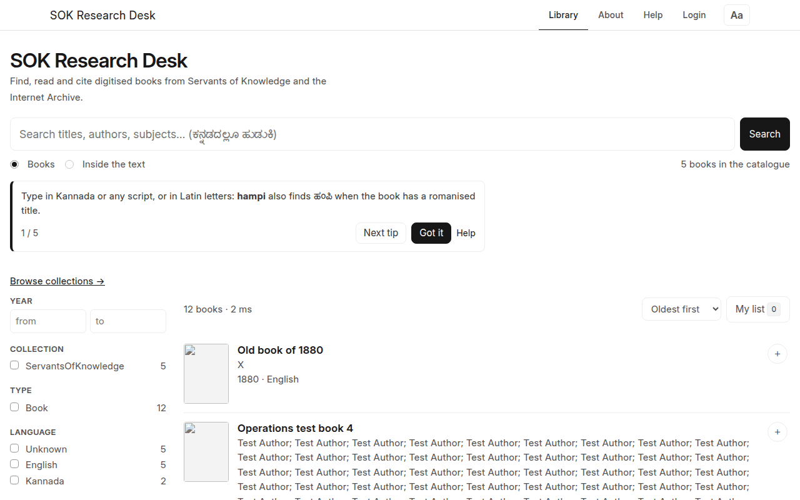
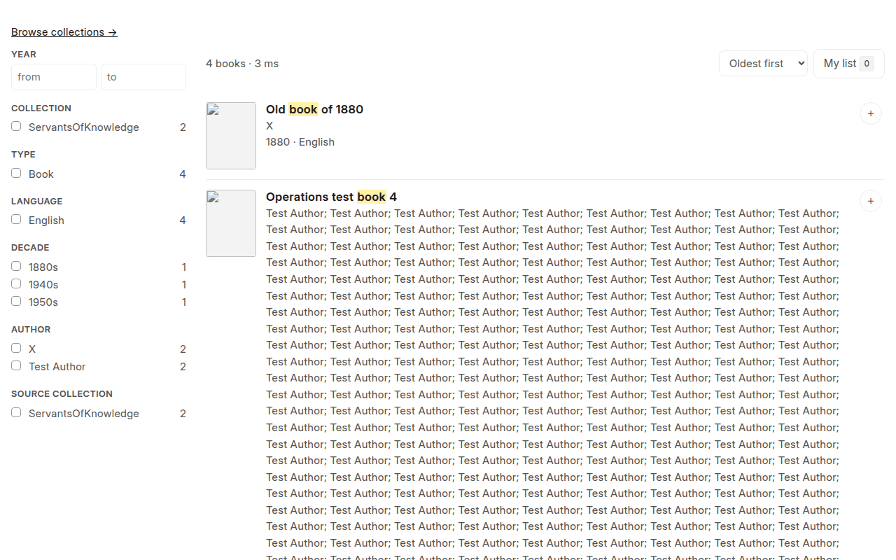
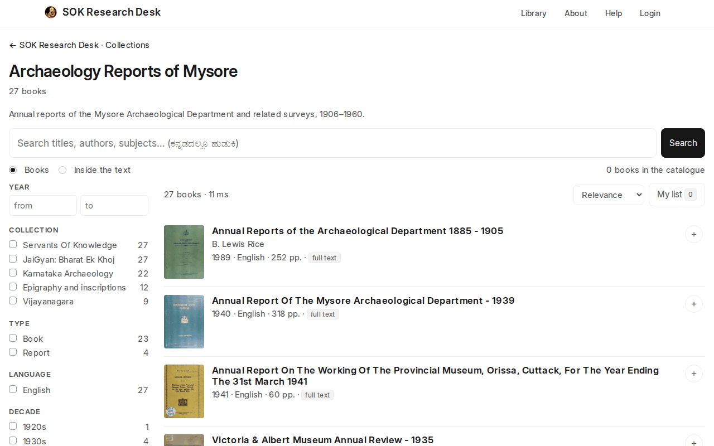
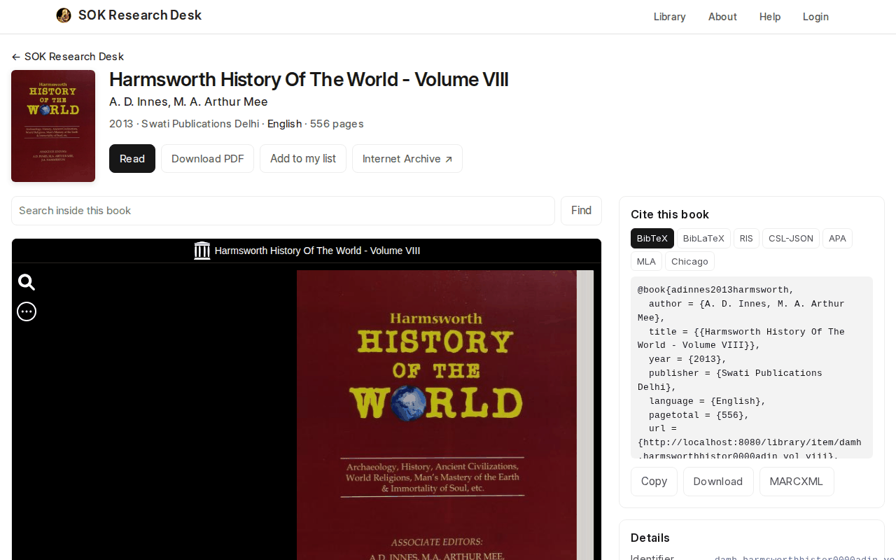
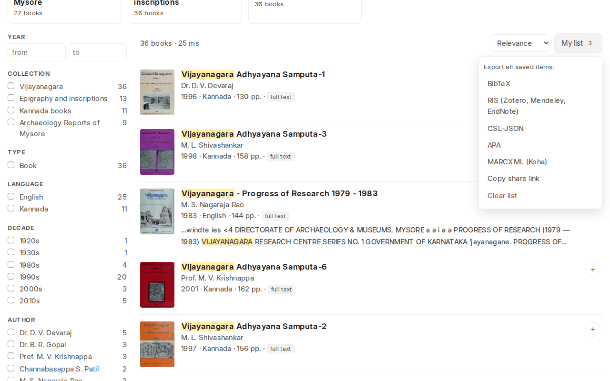
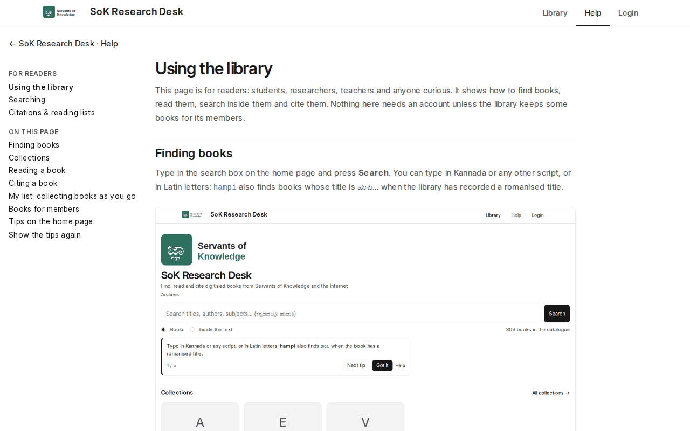

# Using the library

This page is for readers: students, researchers, teachers and anyone curious. It shows how to
find books, read them, search inside them and cite them. Nothing here needs an account unless
the library keeps some books for its members.

## Finding books

Type in the search box on the home page and press **Search**. You can type in Kannada or any
other script, or in Latin letters as you would write the word: `kanakadasa` also finds
ಕನಕದಾಸ, `vachana` finds ವಚನ (the line under the count says *Also searched: …*). Put words in
"double quotes" to find them together, use `OR` for either word, and `-word` to leave a word
out.

Two kinds of search sit under the box:

- **Books** looks at titles, authors, subjects, publishers and descriptions. Each result is a
  book.
- **Inside the text** looks through every page of every book. Each result is a page, with the
  words you searched highlighted. Clicking it opens the book at that page.

Filters on the left narrow the results: **Collection**, **Type** (book, periodical, thesis…),
**Language**, **Decade**, **Subject**, **Author** and **Source collection**, plus a range of
years. Pick several: *Kannada* and *1950s* gives Kannada books from the 1950s. **Sort** puts
the oldest, newest or alphabetical first.

The address in your browser always matches the search, so you can bookmark it or send it to
someone. More on searching: [Searching](searching.md).

## Collections

**Browse collections** (or **All collections**) on the home page lists the groups of books the
library has put together, such as a subject, an author or a course. Each collection has its own
page with the same search and filters, limited to that collection.

## Reading a book

Click a title to open its page. You'll find:

- two ways to read: the **Book reader**, to turn pages, zoom and read online, and **Page & text**,
  which shows one page's image next to its text (see below);
- **Search inside this book**: type a word and press **Find** to list every page where it
  appears (click one to jump there);
- **Download PDF**, when the library can share the file;
- **Cite** and **Add to my list** (below);
- under the reader, the book's **details** (identifier, date, subjects, collections, rights) and
  **about this book**; **Details ↓** at the top jumps there.

The reader takes the whole width of the page, so the pages are as large as your screen allows.

### Page & text

**Page & text** puts each page image next to the text read from it. Turn pages with the arrows
(or the ← → keys), or type a page number. The printed page number, when the page has one, shows
beside it (*p. 39*).

- **Copy page link** copies a link that opens this book at this page, in Page & text.
- **Cite this page** opens the **Cite** window at this page: its reference in APA, MLA, Chicago,
  BibTeX, RIS or CSL-JSON, with its page number and a link to it. Switch to **This book** in the
  same window for the whole book.
- **Open in book reader** switches to the book reader at the same page.

While Page & text is showing, the pages found by **Search inside this book** open here, with the
words you searched for marked.

Scans are old books, and the text read from them by machine (OCR) has mistakes. If a search
inside the book misses a word you can see on the page, try a shorter form of the word.

## Notes on the pages

Logged in, you can keep notes in **Page & text**:

- **Select some words** of the page text: a small bar offers **Highlight** (saved at once),
  **Comment**, **Tag**, **Question**, **Link** (to a Wikidata page, say, about the person or place)
  and **OCR error** (the text doesn't match the page: the library's proofreaders see it).
- **Mark a region** of the page image (a figure, a stamp, a margin note): press **Mark a region**
  and drag a box over it.
- **Who can see it**: only you (the start), a research group you belong to, or everyone once the
  library has looked at it.

Notes show as coloured marks in the text and boxes on the image; click one to find it in the list
under the page. **Show notes** hides them while you read. Your notes stay with their words even
when the page text is corrected later; a note whose words are gone says so.

**My notes** (`/library/notes`) lists your notes on every book, and your groups', to search, open
at their page, and export with the page's citation: as Markdown (for your writing), a spreadsheet,
or W3C Web Annotations (for other annotation tools).

## Proofreading

Readers with the **Proofreader** role (and library staff) correct the text of the pages. Pages
people have corrected are what everyone then reads, searches and cites; the line under the page
says where its text stands: *machine OCR*, *re-OCR*, *proofread by …* or *validated by …*.

In **Page & text**, press **Proofread**: the page text becomes an editor beside the image.

- **Correct the text** to match the page, then **Save as proofread**.
- **Validate**: a page proofread by someone else, checked and found right, is validated
  unchanged. (Change anything and it becomes your proofread version instead.)
- **History** lists the page's versions: who made each, and **Make current** to bring one back.
  Nothing is ever lost.

### Reading a page again (OCR), part by part

When the page's text is poor, or its columns run into each other, have it read again:

1. **Draw the parts** of the page to read: drag a box over each one on the image, as many as the
   page has: a heading, each column, a side note, a footnote. They are read **in the order of
   their numbers**: move one up or down with ↑ ↓, or **Sort** them top to bottom and left to
   right. A layout (*Two columns*, *Three columns*, *Heading and two columns*) draws the usual
   ones for you.
2. Mark a part **skip** to leave it out (a picture, a stamp, a page number).
3. **OCR the zones**: each part is read on its own with the book's language, and the text comes
   back into the editor, part by part, to check and save. Nothing is saved until you do.

**Proofreading** (`/library/proofread`) is the proofreaders' work list: the pages readers
reported as *OCR error*, pages waiting for a second person to validate, and the books with the
poorest OCR, each opening at its page in Proofread mode. Filter by language.

## Citing a book

**Cite** (at the top of a book's page) opens one window for both:

- **This book**: the reference ready to paste in APA, MLA or Chicago style, or as a file for
  your reference manager: BibTeX, RIS or CSL-JSON (Zotero, Mendeley, EndNote, JabRef, Overleaf).
- **This page**: the page showing in Page & text, with its printed page number (*p. 42*, or
  *leaf 7* when none is printed) and a link that opens the book at that page.

**Copy** copies the reference, **Copy link** its link, and **Download** saves the book's as a file.

With the Zotero Connector in your browser, its button on a book page saves the complete record.
More on citing: [Citations & reading lists](citations.md).

## My list: collecting books as you go

Click **＋** on a search result, or **Add to my list** on a book page, to keep a book for later.
**My list** (top right of the results) shows how many you have and lets you:

- export all of them at once as BibTeX, RIS, CSL-JSON, APA or MARCXML, for a bibliography;
- **Copy share link**, which gives an address that adds the same books to anyone's list:
  handy for a course reading list or a research group;
- **Clear list**.

Your list is kept in this browser. Using another computer or browser starts a new list, so share
the link to yourself if you need to move it.

## Books for members

A library can keep some books for its members:

- **Login to read**: anyone can find the book and cite it; reading, searching inside and
  downloading need a login, and the book page shows **Log in to read**.
- **Login to find**: only members can see that the book exists.

If the library allows it, **Create an account** on the login page. Some libraries approve new
accounts first: until then you see what visitors see, and the library lets you know when you're
approved. Ask the library if you're not sure how to join.

## Help and tips

**Help**, in the top bar, opens these pages. The first time you visit, a few short tips appear
under the search box on the home page. Close them with **Got it**, or step through them with
**Next tip**. To see them again, use **Show the tips again** on the help page.

