# Staff guide: a tour of the Desk

This page is for library staff who look after Research Desk: bringing books in, correcting the
catalogue, building collections and deciding who can read what. Installing and running the
server is covered in [Getting started](getting-started.md) and [Operations](operations.md).

Log in, and you land on the **Research Desk** workspace (also at `/app/research-desk`). Readers
never see the Desk; they use the portal at `/`, the site's front page (book pages are at `/library/item/…`).

## The Research Desk workspace

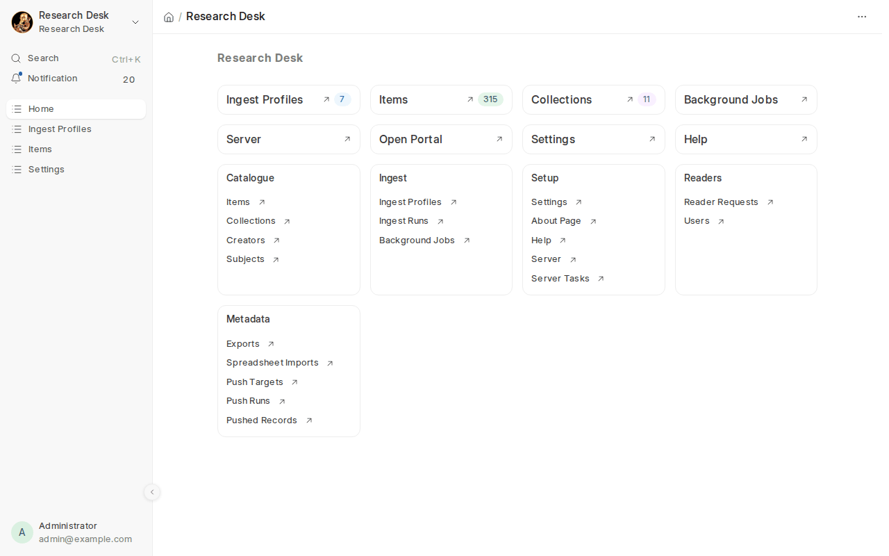

- **Your library today**, at the top (managers): the numbers that matter, each a button to
  where you act on it. *Catalogue*: books on the portal and added this week, pages searchable,
  books waiting for search, average OCR quality. *Readers*: readers, new accounts, who logged in
  this week and month, sign-ups waiting, proofreaders. *Research*: notes this month, public notes
  to review, OCR errors reported, pages proofread and validated. *Preservation*: books preserved,
  failed checks. *Portal use*, when [usage statistics](#usage-statistics) are on. Numbers to act
  on (sign-ups, reviews, failed checks) show in orange. They are worked out at most every five
  minutes; **Refresh** for now.
- **Get started with Research Desk** is a checklist for a new library (see
  [below](#the-getting-started-checklist)). Hide it when you're done.
- **Shortcuts**: Ingest Profiles, Items, Collections, Background Jobs, People & Roles, Server,
  Open Portal, Settings and Help.
- **Cards** list everything else: the *catalogue* (items, collections, authors, subjects,
  authorities, the review queue, readers' notes, page texts, ground truth, preservation), *ingest*
  (profiles, runs, background jobs), *setup* (settings, the About page, portal translations, help,
  the server), *readers* (people and roles, sign-up requests, users) and *metadata* (exports,
  spreadsheet imports, push targets, [library systems](koha.md#option-e-bring-the-librarys-catalogue-in-link-it-send-the-links-back)).

The Desk shows only Research Desk, and its sidebar holds every screen: the catalogue, exchange,
readers and research, keeping, running the library and (for System Managers) an **Administration**
section with Frappe's users, roles, system settings and logs
([Only Research Desk in the Desk](#only-research-desk-in-the-desk)).

## Help, tours and the checklist

### Help on every screen

The help pages, in the Desk and on the portal, carry your library's logo (Settings → Logo &
Branding), or the Servants of Knowledge logo until you set one.

Every Research Desk screen has a **Help** menu at the top:

- **Help for this screen** opens this documentation at the right section, inside the Desk.
- **Take the tour** (on the main forms: ingest profiles, books, collections, settings, exports,
  imports, push targets, research groups, annotations and page texts) walks through the
  important fields one at a time. Press **Next** to move on, or **Close** to stop.
- **All help pages** lists everything, for staff and for readers.

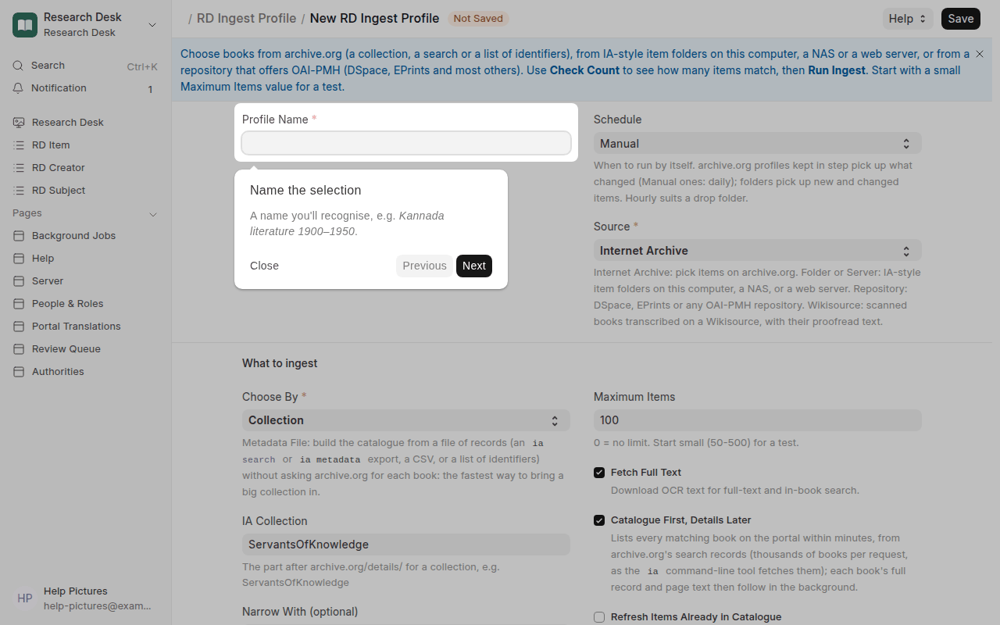

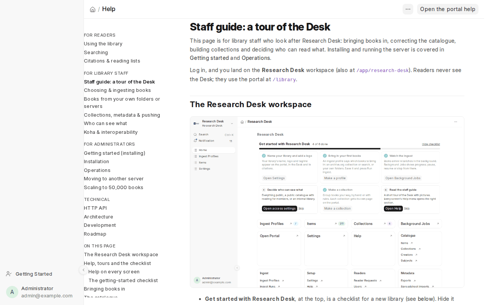

The same pages are on GitHub, and readers have their own help on the portal at `/library/help`.

### The getting-started checklist

Seven steps take a new library from an empty install to a working portal: name and logo, a first
selection of books, watching the ingest, access, a first collection, readers' notes and proofreading,
and this guide. Each step's
button opens the right screen, often with its tour. Steps tick themselves when the library has
done them some other way (a logo is set, an ingest has finished, a collection exists). **Skip**
sets a step aside; **Hide checklist** folds the block away once you don't need it. A line
*The getting-started guide is hidden. Show the guide again* stays in its place on the workspace,
so it is one click to bring back with your progress kept. Help → menu (⋯) → **Restart the
getting-started checklist** brings it back from scratch (ticks and skips forgotten). Only
managers see it.

## Bringing books in

An **ingest profile** says which books to bring in and how often: an archive.org collection or
search, a list of identifiers, or IA-style folders on your own disk or server. Press **Check
Count** to see how many books match, then **Run Ingest**.

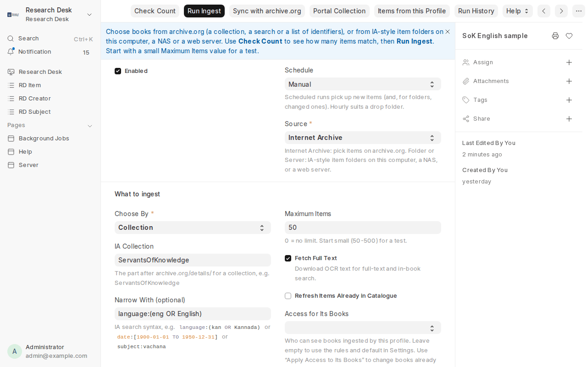

After the first run a profile keeps itself in step with archive.org: new books come in each
day, changed ones are refreshed, removed ones are unpublished, and its portal collection follows
along ([more](ingesting.md#keeping-in-step-with-archiveorg)). **Sync with archive.org** on the
profile does it straight away.

Books arrive in batches in the background. Only the details and the text of each page are
downloaded; scans stay on archive.org (or your server) and are shown from there. Details:
[Choosing & ingesting books](ingesting.md), [Your own folders & servers](local-folders.md) and
[Books from repositories](repositories.md); loose PDFs and scans read with OCR:
[Loose PDFs and scans without text](local-folders.md#loose-pdfs-and-scans-without-text).

**Background Jobs** shows every run, queued job and schedule, with progress, and lets you
**Pause** and **Resume** a run, **Pause All** background work, or stop it
([more](operations.md#background-jobs-see-pause-and-stop-what-is-running)).

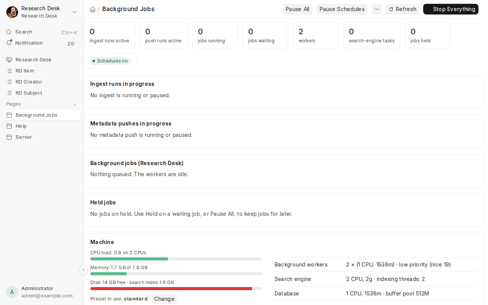

A big collection comes in fastest from a **metadata file** (an `ia search` or `ia metadata`
export): see *Importing a metadata file* in [Choosing & ingesting books](ingesting.md).

## Material that is not a book

The same ingest profiles and the same Desk handle more than books; each has its own page:

| Material | What the library gets | Read |
|---|---|---|
| Manuscripts and palm leaves | a description, leaf labels (1a, 1b, r/v), transcription from blank, deep zoom, a list of what needs transcribing | [Manuscripts](manuscripts.md) |
| Photographs | EXIF read, who and where, tags (Wikidata), a checksum of the original, a zoom, and sending to Wikimedia Commons | [Photographs](photographs.md) |
| Audio and video | a player, a time-coded transcript people can correct, captions, IIIF manifests; a machine draft of the transcript | [Audio and video](audio-video.md) |
| A Calibre library | its books catalogued where they are, downloadable, EPUB text searchable | [Calibre](calibre.md) |
| Wikisource books | their proofread text and images, and your corrections sent back | [Wikisource](wikisource.md) |
| Deposits | people give their own work; a reviewer accepts it, with a licence and an embargo | [Repository deposit](deposit.md) |
| An archive's papers | fonds, series, file and item (ISAD(G)), on the portal and as EAD3 | [Archival description](archival-description.md) |

Which of these a library sees is chosen under [Features and your institution](#features-and-your-institution):
a library that keeps no manuscripts never sees the manuscript fields. **Machine drafts** (speech to
text, handwriting recognition) are set up under Settings → *Machine Drafts*; every draft is a
version for a person to proofread, and none is ever shared as ground truth.

## The Server page

**Server** shows whether every part of Research Desk is working, which version runs and whether
a newer one is out, the backups, recent errors and logs. Managers get an alert (in the Desk, by
email or a webhook) when something stops working. With the updater helper turned on, a System
Manager can also upgrade, restart and apply resource presets from here.

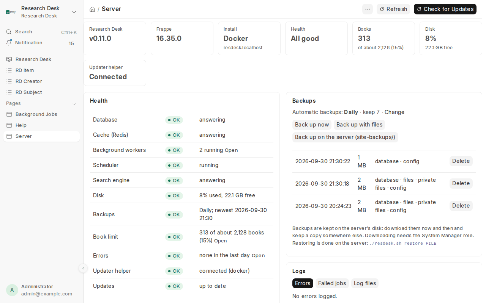

Details: [Server: updates, health & backups](server.md).

## The catalogue

**Items** lists every book. Filter the list like any Desk list (by language, collection, type,
who can see it…), tick books to act on many at once (**Actions → Add to / Remove from Collection** or **Set
Who Can See Them**), or open one to edit it. The menu (⋯) does the same for every book matching
the filters, and exports their metadata.

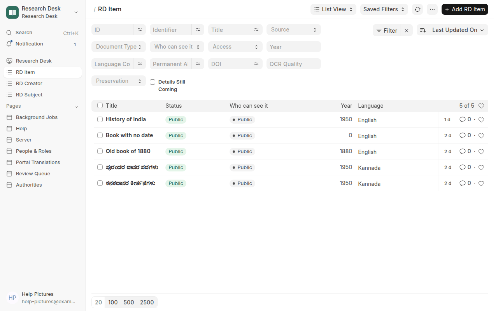

On a book's form you can correct the title (and add a romanised title), authors, date,
publisher, language, subjects, document type, collections and rights. Your changes reach the
portal and search within seconds, and **Keep My Edits** is ticked so that bringing the book in
again doesn't overwrite them. See [Editing catalogue details](collections-and-metadata.md#editing-catalogue-details).

To change many books at once, export a spreadsheet, edit it and import it back
([how](collections-and-metadata.md#editing-many-books-with-a-spreadsheet)).

### Authors and subjects

**Creators** and **Subjects** are made automatically from the books' details, one record per
person or heading, so the portal can filter by them. Open a creator to add a romanised name,
a sort name (Family, Given), or its VIAF and Wikidata identifiers.

**Authorities** (Research Desk → Catalogue, or `/app/resdesk-authorities`) matches them to the
records other libraries share: authors to people on **Wikidata** (and through Wikidata to
**VIAF**), subjects to **Library of Congress Subject Headings**.

1. **Find matches** looks up the next names in the background, the ones with most books first
   (or switch on **Find Authority Matches Nightly** in Settings → Authorities). Each author is
   searched in every form the catalogue has (as printed, romanised; Kannada names in Kannada).
2. Under **Proposed**, each name shows its candidates with a score and the reasons: how alike
   the names are, whether the candidate is a person, and whether their dates fit the books (a
   writer born after the book was printed is unlikely). Choose **This one**, **None of these**,
   or **Search again** with other words or a Wikidata Q-number.
3. A match fills in the Wikidata and VIAF identifiers, the person's dates and a description. If
   another catalogue name is the same person (*Purandaradasa* and *Purandara Dasa*), you are
   offered to put all their books under one name; each book keeps its name as printed.

What it changes: matched authors get an **(about)** link on their books' pages, to a page with
everything the library has by them (and readers' notes about them); MARC records carry the VIAF
and Wikidata identifiers (`$0`, `$1`) and matched subjects become LCSH headings (650 with `$0`);
JSON-LD names the person with `sameAs`; DOIs carry name identifiers. **Undo** takes a match
back. **Accept Near-Certain Matches** (Settings) accepts, without a person, only a single person
with the same name whose dates fit and no rival close behind; everything else waits for you.

### Giving back to Wikidata and the Library of Congress

Matching teaches the library things the authorities don't know yet. **Authorities → Give back**
gathers them:

- **names**: the person's name as the library's books print it, in their script (ಕನಕದಾಸ for
  someone Wikidata names only in English): a label where Wikidata has none in that language,
  otherwise another name (alias);
- **author links**: on the library's book items on Wikidata (the ones a Wikidata Push Target
  created or found), *author* linked to the person, with the name as printed (*stated as*), where
  the item names the author only as text. Books pushed from now on link matched authors that
  way from the start.

**Work it out again** asks Wikidata what each person and book already has (it takes a minute).
Then either **Download QuickStatements** (the list in the format of Wikidata's batch tool: a
Wikidata editor reviews it at quickstatements.toolforge.org and runs it under their own
account, the usual way for libraries new to Wikidata) or **Send to Wikidata** through the
library's Wikidata Push Target (a dry-run target only counts what would be sent). Nothing on
Wikidata is changed or removed; each statement cites the book's page on the portal.

Subjects with no Library of Congress heading (*None of these*, or nothing found) are listed by
**Download for SACO**, with how many books use each and example titles: libraries in the
Library of Congress's SACO programme propose new headings from such lists. There is no service
to propose them directly.

## Collections

A **collection** is your own group of books with its own page on the portal: a subject, an
author, a course, an exhibition. Add books by hand, in bulk from the Items list or a portal
search, with a spreadsheet, or with rules that also catch new books as they arrive. Collections
that mirror archive.org get their picture from there; upload your own to replace it, or use **Get
Image from archive.org** to take it again
([Collection images](collections-and-metadata.md#collection-images)).

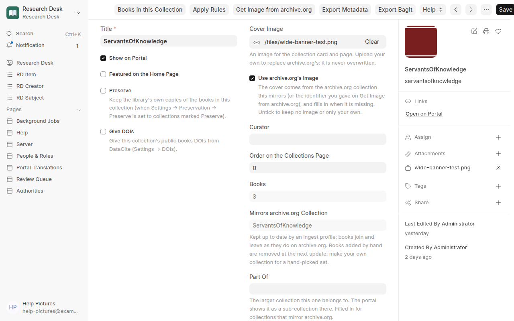

Details: [Curated collections](collections-and-metadata.md#curated-collections).

## Who can see what

Each book is **Public**, **Login to read** (anyone finds and cites it; members read it) or
**Login to find** (members only). A site-wide setting decides what visitors who aren't logged in
can do, and another how readers get accounts: added by staff, open sign-up, or sign-up with
approval (requests wait under **Reader Requests**). Details: [Who can see what](access.md).

## Metadata out

- **Exports**: the catalogue, or part of it, as a spreadsheet, MARCXML for Koha, MODS or Dublin
  Core, JSON-LD, BibTeX/RIS, or files for archive.org.
- **Push Targets**: send details straight to the Internet Archive, Koha, Wikidata or another web
  service. Start with a dry run.
- **OAI-PMH**: Koha and other systems can harvest the catalogue, or a single collection.
- **IIIF** and **OPDS**: every item is a manifest for Mirador or Universal Viewer, and the library
  is a catalogue for e-reader apps ([IIIF](iiif.md), [OPDS](opds.md)).
- **Taking the library away**: an offline copy of a collection for USB sticks and Kiwix, a small
  Calibre collection, and EAD3 finding aids ([Offline copies](offline.md), [Calibre](calibre.md),
  [Archival description](archival-description.md)).
- **Giving back to Wikimedia**, under your own account ([Wikimedia](wikimedia.md)).

See [Collections, metadata & pushing](collections-and-metadata.md) and [Koha](koha.md).

## Settings

**Settings** (RD Settings) holds everything that applies to the whole library, in tabs by who
looks after it:

| Tab | For | What you set there |
|---|---|---|
| Library & Portal | whoever runs the library | the name, tagline, public web address, OAI identifier and admin email; the portal's languages, the order books are listed in; logo, icon and home-page picture |
| Features | the library's managers | what kind of institution this is (profiles that combine), the features it uses, suggestions from its data |
| Readers & Access | the library's managers | what visitors can do, the default for new books, reader accounts, what OAI-PMH shares, access rules; what staff see in the Desk; usage statistics |
| Catalogue | cataloguers | archive.org (contact, pace, batches, pausing), collections kept in step with archive.org, matching authors and subjects to authorities |
| Search | whoever runs the machine | the search engine's address, whether page text is indexed, search in Latin letters; **Rebuild Search Index** |
| Sharing & Identifiers | partners and researchers | permanent ARKs, DOIs from DataCite, corrected pages shared as OCR ground truth (the licence, the credit line, and whether proofreaders must have released their pages), and **Machine Drafts**: the speech model and the handwriting engine |
| Preservation | archivists | the library's own checked copies, and a second copy in another folder or bucket |
| Server | whoever runs the machine | workers and other resources, the book limit, quiet hours, updates, backups and alerts ([more](server.md)) |

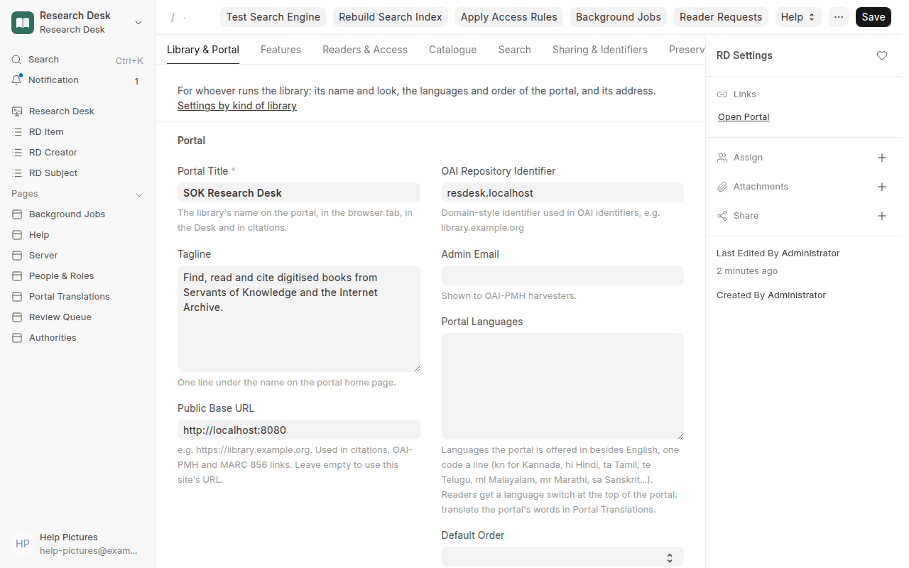

Take the tour on the Settings form for the fields most libraries change first. Every setting
is described in [Operations → Changing settings](operations.md#changing-settings).

### Settings by kind of library

Most libraries change only a few settings. Start from the row closest to yours:

| Kind of library | Look at first |
|---|---|
| **A small library on a laptop or desktop** | *Library & Portal*: name, logo, languages. *Server*: the **light** preset and quiet hours, so the machine stays usable. Leave *Preservation* and *Sharing* off until needed |
| **A public research portal** (like Servants of Knowledge) | *Library & Portal*: portal languages, **Default Order**. *Search*: search in Latin letters. *Catalogue*: **Find Authority Matches Nightly**. *Sharing*: ARKs (once the NAAN is assigned), DOIs for chosen collections. *Readers & Access*: usage statistics |
| **A members-only or institutional collection** | *Readers & Access*: what visitors can do (records only, or nothing), **sign-up with approval**, access rules for collections or languages, what OAI-PMH shares |
| **An archive keeping its own copies** | *Preservation*: keep books (and page images), fixity checks, a **second copy** (S3 or another disk), serve from our copy when archive.org drops a book. *Sharing*: ARKs. The *Archival description* feature, to describe the papers as a hierarchy |
| **A manuscript library or a photograph archive** | the matching kind under *Features*; [leaf labels and transcription](manuscripts.md) or [photographs](photographs.md); *Sharing*: ground-truth releases, so corrected leaves can train a recogniser; *Machine Drafts* if you install an engine |
| **A language-technology partner** (OCR, Indic NLP) | *Sharing*: the ground-truth licence and attribution. *Catalogue*: authorities. The [review queue](#the-review-queue) and [proofreading](#proofreading-and-re-ocr) for better text |

## Features and your institution

Not every library uses everything. **Settings → Features** says what this library is and what it
uses.

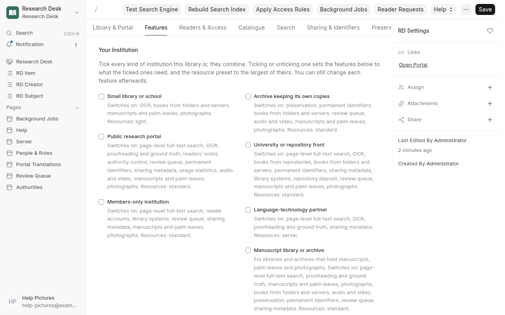

**Your institution** (the installer asks it first; [Installation](installation.md#docker-one-command)): tick every kind that fits: *Small library or school*, *Public research
portal*, *Members-only institution*, *Archive keeping its own copies*, *University or repository
front*, *Language-technology partner*, *Manuscript library or archive*, *Photograph archive*. They combine: a library can be a public research portal and
an archive at once. Ticking or unticking one sets the features to what the ticked kinds need, and
the resource preset (Settings → Server) to the largest of theirs. You can still change each feature
afterwards.

**Features**: each can be switched off:

| Feature | What it covers |
|---|---|
| Page-level full-text search | search inside the text of every page; off saves most of the search engine's disk, memory and CPU |
| OCR | reading scans, re-OCR of pages and books |
| Proofreading and ground truth | correcting and validating page text, sharing corrected pages |
| Readers' notes | highlights, comments, tags, OCR error reports, research groups |
| Authority control | authors and subjects matched to Wikidata, VIAF and LCSH, giving back |
| Review queue | records checked for what needs a cataloguer |
| Preservation | the library's own checked copies, fixity, a second copy, BagIt |
| Permanent identifiers | ARKs, DOIs, tombstones |
| Books from folders and servers | IA-style folders and loose PDFs |
| Photographs | [photographs as items](photographs.md): EXIF, who and where, a SHA-256 of the original, zoom |
| Audio and video | [recordings with a player and a time-coded transcript](audio-video.md) |
| Manuscripts and palm leaves | [their description, leaf labels and transcription](manuscripts.md) |
| Repository deposit | people [deposit their own work](deposit.md) for review, with licence and embargo |
| Books from a Calibre library | a [Calibre library](calibre.md) read in place: details, covers, PDF text, other formats to download |
| Books from repositories | DSpace, EPrints, any OAI-PMH repository, and [Wikisource](wikisource.md) |
| Giving back to Wikimedia | each person connects their own [Wikimedia account](wikimedia.md); gifts to Wikidata, corrected Wikisource pages and photographs for Commons go under it |
| Library systems | a Koha or other catalogue matched to the books here |
| Sharing metadata | the OAI-PMH provider, [IIIF manifests](iiif.md), the [OPDS](opds.md) catalogue, and pushes to Koha, Wikidata, archive.org, webhooks |
| Archival description | an archive's papers as [fonds, series, file and item](archival-description.md), on the portal and as EAD3 |
| Reader accounts | sign-up, sign-up requests, members-only reading |
| Usage statistics | how readers use the portal |

A feature that is off is **not collected**: its scheduled work stops, its screens leave the Desk,
and nothing new of its kind is made (an ingest profile of a switched-off source, a new note, a
proofread page are refused, saying so). What already exists stays, and **who sees it is still
decided by access**: roles and each book's visibility, never these switches. The catalogue,
archive.org, book search, the reader, collections, citations and the Server page are always on.

**Suggestions**: when data arrives that a switched-off feature would handle, the Features tab
and the Research Desk workspace (*Features to consider*) say so, with the numbers and a **Turn on**
button. For example: scans with no text while OCR is off, members-only books while reader accounts
are off, book folders waiting in the library folder while books from folders are off. Turning a
feature on stays your decision.

## The review queue

**Review Queue** (Research Desk → Catalogue, or `/app/resdesk-review`) lists the books whose
records need a person's eye, the most important questions first:

| Question | What it means |
|---|---|
| Year looks wrong · Language doesn't match the title's script · Title looks wrong · Possible duplicate | most likely wrong: a year before printing or in the future; a Kannada-script title catalogued as English; a title that is the identifier, a file name or all capitals; the same title, first author and year as another book |
| No year · Language unknown · Author looks wrong | missing or doubtful (*Unknown*, *Anon.*, a number) |
| No author · No subjects | worth filling in when you can |

Each night every published book is checked again (**Scan now** checks at once). For each book:

- correct the **title**, **year** or **language** right on the page and **Save** (kept through
  re-ingest, as edits on the book's form are), or open the book for anything else;
- **This is right** answers the question for good (a book that really has no author);
- for a possible duplicate, **Hide this copy** takes it off the portal (it stays in the Desk), or
  **Not a duplicate** keeps both.

A corrected record leaves the queue as soon as it is saved, wherever it was corrected.

## The About page

**About Page** (Research Desk → Setup, or `/app/rd-about-page`) is the introduction to your
library at **`/about`**: what the library is, whose books these are, how to use it, and a big
button to the library. It has a link in the portal's top bar, next to *Library*.

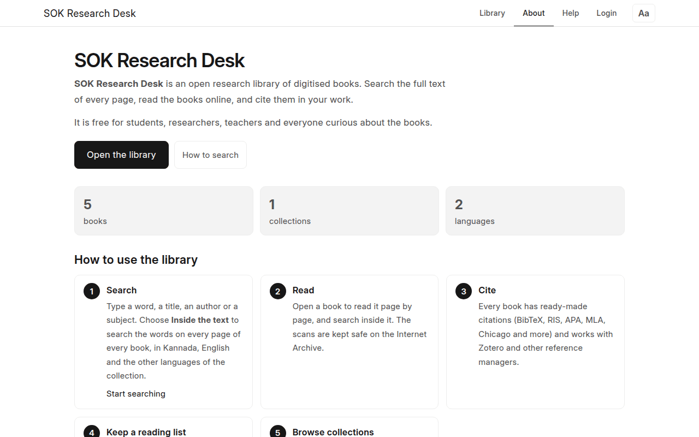

A new install starts with a ready-made page to change. Fill in the parts you want; empty parts
are left out:

| Part | What goes there |
|---|---|
| Page | **Show the About Page** (untick to hide it and its top-bar link; `/about` then goes to the library), the **label** in the top bar, the page title and description for search engines |
| Introduction | headline (empty: the portal's name), tagline, the **introduction** in a rich-text editor (headings, bold, lists, links, pictures), an optional image beside it, and **live numbers**: books, pages of searchable text, collections and languages, counted as visitors see them |
| Buttons | the main button (*Open the library* → `/`) and an optional second one (*How to search* → `/library/help`). Links are a page of this site (`/library/collections`, `/?q=hampi`) or a web address (`https://…`) |
| How to Use It | numbered steps: title, a sentence or two (`**bold**` works), and an optional link |
| Highlights | cards for what makes the library useful, and **Show Featured Collections** (the collections marked *Featured*) |
| More | anything else, written freely in the rich-text editor: the story of the collection, partners and funders, contact, credits |

**Save**, then **View Page**. Changes show straight away.

## The portal in other languages

The portal can be offered in Kannada, Hindi, Tamil and any other language Frappe knows, beside
English. Readers choose their language with the switch at the top of every portal page; a
browser set to Kannada gets Kannada the first time. For someone logged in, the switch also sets
their account's language, so the Desk follows it (change it back under *My Settings*). Book titles, page text and notes stay as
they are: what changes is the portal's own words (menus, buttons, messages, help on the page)
and the library's words (its name and tagline, the About page, collection titles and
descriptions).

1. **Settings → Portal → Portal Languages**: one language code a line, e.g. `kn` (Kannada),
   `hi` (Hindi), `ta` (Tamil), `te` (Telugu), `ml` (Malayalam), `mr` (Marathi), `sa` (Sanskrit).
   Save: the language switch appears on the portal.
2. **Portal Translations** (Research Desk → Setup, or `/app/resdesk-translations`) lists every
   phrase readers see, where it is used, and a column for each language. Type a translation; it
   is saved when you leave the box. **Only phrases still to translate** shows what is missing;
   the counts at the top say how much is left for each language.
3. Or translate offline: **Download spreadsheet** (CSV, opens in Excel, LibreOffice or Google
   Sheets), fill in the language columns, save as CSV (UTF-8) and **Upload spreadsheet**. Filled
   cells become translations; empty cells change nothing.

Phrases with `{0}`, `{1}` have numbers or names put in their place (`{0} books` →
`{0} ಪುಸ್ತಕಗಳು`): keep each of them in the translation, wherever the language needs it.
Translations are Frappe *Translation* records, so they are kept in backups and moved with the
site; Cataloguers and Managers can edit them. When you change a collection's title or the About
page, its new words appear in the list to translate (the old translation no longer applies).

## The portal's address

The library's search page is the site's front page: **`/`**, e.g.
`https://research.example.org/`. Searches are `/?q=hampi`, and the other pages keep their
addresses: books at `/library/item/…` (the stable addresses in citations), collections at
`/library/collections`, help at `/library/help`, the About page at `/about`. Old links to
`/library` (and searches like `/library?q=hampi`) still work: they lead to `/`.

To have visitors land on the **About page** instead, set *Home Page* to `about` in Desk →
Website Settings. The library's search page then moves to `/library` by itself, and every link
to it follows; set *Home Page* back to `library` to return.

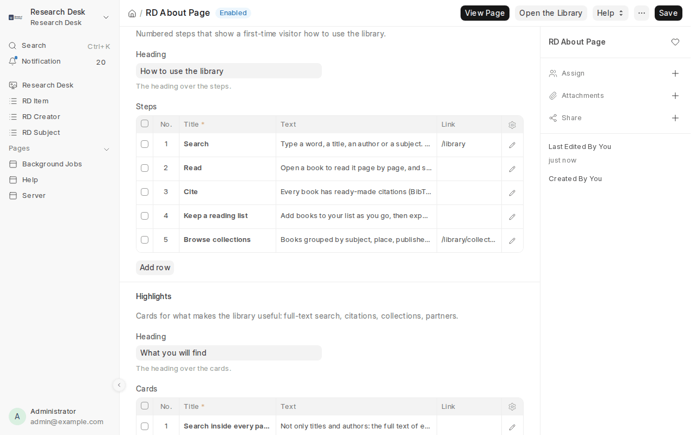

## Roles

| Role | Can |
|---|---|
| ResDesk Manager | everything in the library: settings, ingests, background jobs, access, pushes, readers; the Server page and backups |
| System Manager | also upgrades, restarts and downloading backups on the Server page |
| ResDesk Cataloguer | edit books, authors, subjects and collections; exports and spreadsheet imports; read ingest runs |
| ResDesk Reader | the portal only: read members-only books |
| ResDesk Proofreader | the portal only: correct and validate page text, and read pages again with OCR |

Give and take roles on **People & Roles** (below).

### Only Research Desk in the Desk

Staff work in Research Desk; they don't need Frappe's own workspaces (Build, Users, Website,
Integrations, Printing, Email and the rest). So the Desk's sidebar, its apps screen and its
search show **only Research Desk** to everyone with a staff role (Manager, Cataloguer) or System
Manager, and everyone lands in Research Desk after logging in. Nothing a person may *do*
changes: roles still decide that, and everything staff need (People & Roles, Users, Background
Jobs, Server) is linked from Research Desk.

The sidebar lists **every Research Desk screen** in sections (Catalogue, Exchange, Readers and
Research, Keeping, Running the Library), each shown only to those who may open it, and the screens
of a switched-off feature are not listed. For System Managers, including the built-in
**Administrator** account, an **Administration** section adds Frappe's own tools an administrator
needs: Users, Roles, User Permissions, the Permission Manager, System Settings, Email Accounts,
Email Queue, Error Log, Scheduled Job Log, Access Log, Files, Translations, Module Profiles and Data
Import. Frappe's own desktop (the apps screen) is closed for everyone, so there is one place to work
and no way to get lost: its home icon is gone and its address leads back to Research Desk.

Settings → *Readers & Access* → **The Desk** → *What Staff See in the Desk* changes this:

| Choice | Who sees Frappe's own desktop |
|---|---|
| Research Desk only, for everyone (the default) | nobody; Frappe's tools are under Administration |
| Research Desk only, except Administrator | Administrator only |
| Research Desk only for staff; System Managers see everything | Administrator and System Managers |
| Everything (Frappe's own tools too) | everyone, as in plain Frappe |

Changing it updates every account straight away; new accounts, and accounts given a staff role
later, follow it too. (It works through a Module Profile called *Research Desk only*; don't edit
that profile by hand, it is rebuilt after every upgrade so Frappe's new modules are hidden too.)

## People and roles

**People & Roles** (Research Desk → *People & Roles*, managers) shows who can do what:

- **A card per role** with how many people have it, what it allows, and whether it works in the
  Desk or only on the portal. Click a card to list just those people; click it again for everyone.
- **The people**, newest first, with a tick box per role: tick to give a role, untick to take it.
  Giving a staff role (Manager, Cataloguer) lets the person into the Desk; readers and
  proofreaders stay on the portal. Find people by name or email; **Show switched-off accounts**
  lists those too.
- **Switch off** an account to stop it logging in (its notes and corrections stay), and **Switch
  on** to let it back.
- **Invite people**: one or more email addresses (one per line), the roles to give, and whether to
  send a welcome email. Existing accounts just get the roles.
- **Sign-ups waiting for approval** show at the top, with **Approve** and **Reject**.

Only a System Manager gives or takes the System Manager role. Nobody can take a manager role
from themselves or switch themselves off, so a library can't lock itself out. The full Frappe
account screen stays one click away (**⋯ → All accounts**).

## Usage statistics

Settings → **Usage Statistics** counts how readers use the portal. The Desk is never counted,
no cookies are set, and nothing about who a reader is goes with the numbers.

| Choice | Where the numbers are | What it costs |
|---|---|---|
| **Off** (the start) | nowhere | nothing |
| **Built-in** | on this server (Frappe's page-view log): page views and visitors this week and the most-read books, on the dashboard; the full log under *Web Page View* | one small database row per page seen; nothing leaves the server |
| **PostHog** | PostHog (cloud in the US or EU, or your own): pages, searches, funnels, its own dashboards | one script from the service on portal pages |
| **Plausible** | Plausible (cloud or your own): a simple, privacy-first page dashboard | a very small script |
| **Umami** | Umami (cloud or your own) | a very small script |

For PostHog, Plausible or Umami, give the **service address** (e.g. `https://eu.i.posthog.com`),
the **project key or site id**, and optionally the **dashboard link** shown on the Research Desk
dashboard. Besides page views, the portal sends a few named events: *Search* (books or inside the
text, with how many results), *Search inside a book*, *Reader opened*, *Citation copied* (book or
page, format), *Note added* (kind, visibility) and *Page proofread*. A visitor's browser asks for
the choice once per visit, so a change shows to new visits.

With **Built-in**, a manager can also download a COUNTER style report of each book's views by
month for a funder or consortium: see [Usage reports](usage-reports.md).

## Readers' notes

Readers keep notes on the pages of books in **Page & text** (see the reader guide). In the Desk:

- **Annotations** (Research Desk → *Annotations*) lists every note. Notes made public wait for a
  manager: filter **Review** = *Pending*, open one, read it on its page (**Open on its Page**) and
  **Approve** or **Reject** it. Only approved ones show to other readers.
- **OCR error** reports reach the managers whoever made them, private or not: filter **Kind** =
  *OCR error* to see where the page text needs correcting (see Proofreading below).
- **Research Groups** (Research Desk → *Research Groups*): a class, a project or a reading circle.
  Add the readers as members; they can then share notes with the group.

A book's notes are also open to other annotation tools through the **W3C Web Annotation
Protocol**: `/api/method/sok_resdesk.annotation_protocol.annotations/<id>/` lists the notes a
visitor may see (public ones for everyone) and takes new ones from logged-in readers (their
session or an API key, made on their user record); they arrive private. The older
`sok_resdesk.annotations.collection?item_id=<id>` (approved public notes) still answers.

**Notes as data.** A note can say what its passage is about: a Wikidata item (**About** in the
reader, *About (Wikidata)* on the Annotation). Approved public notes then list their page on the
portal's page for that item (`/library/entity/Q…`) and for each tag (`/library/tag/…`), their
names and tags are searched with the book, and exports carry the Q-number. Approving, editing or
deleting a public note updates the book's search entry by itself.

## Proofreading and re-OCR

A page's text starts as archive.org's OCR. It is improved two ways, and each change is kept as a
**page text version** (Research Desk → *Page Texts*): the page's current version is what readers
see, search finds and citations quote. Re-ingesting a book never undoes a correction.

- **Proofreaders** correct pages in the portal (Page & text → **Proofread**; see the reader
  guide). Give a volunteer the **ResDesk Proofreader** role (portal only); cataloguers and
  managers can proofread too. A page is **Proofread** by one person and **Validated** by a second
  one who checks it unchanged. Their work list is `/library/proofread`: OCR error reports not
  corrected yet, pages to validate, and the books with the poorest OCR.
- **Re-OCR** reads page images again with Tesseract and the book's language model (Kannada,
  Hindi, Marathi, Sanskrit, Tamil, Telugu, Malayalam, Bengali, Gujarati, Punjabi, Oriya, plus
  English; installed in the Docker image). In Proofread mode a page is read **part by part**:
  the proofreader draws its columns, headings and side notes, in reading order.
- **Several languages.** A page is read with all the book's languages at once: its language,
  any languages named in its language label ("Kannada and English", "Sanskrit; Kannada"), and
  English, which most books carry somewhere. Set **OCR Languages** on a book's form (e.g.
  `kan, san, eng`; codes or names, the main one first) when it needs a different list. The
  **Re-OCR this book** window lets you tick the languages for that run, and in Proofread mode
  each part of a page can have its own. (Before 0.29 a book catalogued as *multiple languages*
  was read in English only.)
  For whole books, in the background: **Re-OCR this book** on a book's form, or Items → **Re-OCR
  the worst books** (the poorest OCR quality first). Choose the layout most pages have (*Whole
  page*, *Two columns*, *Three columns*, *Heading and two columns*). A new text is kept only where
  it scores clearly better than the page's text (5 points of OCR quality), and **pages people
  have proofread are never replaced**. The book's **Re-OCR** field says how it went.

Page images come from archive.org (one request a page), or are drawn here from the book's PDF or its leaf photographs, so re-OCR works for both. **Machine drafts** (speech to text, handwriting recognition) are separate: [Material that is not a book](#material-that-is-not-a-book).
Re-OCR runs on the long queue and stops with **Pause All**. Each version records the engine and
the zones it was read with.

## Sharing ground truth

Every page proofread (and validated by a second person) is **ground truth**: a page image with
the text that is truly on it. Many of them, in Kannada, Sanskrit, Tamil or Hindi, are what better
OCR for Indian languages is trained and measured on. **Ground Truth** (Research Desk → *Ground
Truth*) makes them into sets to share:

1. **New**: give the set a title and choose its pages: *Proofread or validated* or *Validated
   only*, a collection, a language, a single book, at most how many pages. **Only Books Anyone
   Can Read** (on by default) leaves out books for members only. **Include Page Parts** also cuts
   out each part a proofreader drew (a column, a heading) with its own text.
2. Save and **Make the Set**. The form says how many pages match; page images come from
   archive.org one at a time, so a big set takes a while. You get a notification when it is ready.
3. **Download** it: a zip with each page image and its text (`.gt.txt`), the page parts, a
   manifest (CSV and JSON Lines, with checksums), a Frictionless Data Package description, a
   README and the licence.

**People release their own corrections.** Everyone who proofreads or validates is asked to release
what they correct under an open licence of their choice: Research Desk → **My Release for Ground
Truth** (CC0, CC BY or CC BY-SA, and whether they may be named in the credits). The proofreading
page shows the invitation until they answer. Withdrawing is deleting the record: sets made after
that leave their pages out. A set carries a page only if everyone who proofread or validated it has
released it under a licence the set can carry (CC0 allows any set licence; CC BY allows CC BY and
CC BY-SA; CC BY-SA allows only CC BY-SA). The set's form says how many pages were left out and
whom to ask; **Only Pages Their Proofreaders Released** (Settings → Ground Truth) switches the
rule off for libraries whose proofreaders have agreed in writing.

**The set's licence.** Settings → **Ground Truth** → *Licence for Ground Truth* (CC0, CC BY or CC
BY-SA) is the library's decision. Until one is chosen, sets are made for the library's own use
(their README says so) and none can go on the portal.

**Look before it is released.** After **Make the Set**, **Review the Set** shows a spread of its
pages with their text, the licence and the number left out. When you are content, **Mark
Reviewed**, then **Put on the Portal**: it is listed at `/library/ground-truth` for anyone to
download, with its licence, the credit line from Settings and its checksum. Making the set again
clears the review. Contributors are named only when they allowed it in their own release.

## DOIs

For libraries that are **DataCite** members (directly or through a consortium), the books of
chosen collections can have DOIs, the identifiers journals and citation indexes expect.

1. Settings → **DOIs**: the **DOI Prefix** (e.g. `10.12345`), the **DataCite Repository ID** and
   password from DataCite Fabrica, and a **DOI Shoulder** (`rd.` by default: DOIs then read
   `10.12345/RD.KANAKADASA1950`; never change it once DOIs are given). Leave **DataCite Test
   System** ticked while trying it out: test DOIs never resolve and never show in citations.
   Tick **Give DOIs** and save.
2. On a collection, tick **Give DOIs**, save, and **Register DOIs**: its public books are sent
   to DataCite in the background. After that, every night, new books in such collections get
   DOIs and changed ones are sent again (only when their metadata changed).

Each DOI points at the book's permanent link (its ARK when it has one) and carries its title,
authors, year, language, subjects, description, licence and archive.org identifier, with the
library as publisher. A book's form shows its **DOI** and **DOI State** (*Test*, *Findable*,
*Failed*); **Actions → Send to DataCite** sends one book now. Findable DOIs appear in every
citation format, the page's Zotero tags, Dublin Core, MODS, OAI-PMH and JSON-LD. A deleted book
keeps its DOI, which is pointed at its tombstone page. The Server page's *DOIs* line counts the
registered and failed ones.
